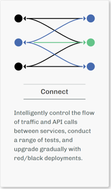
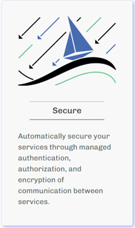
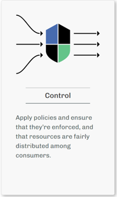
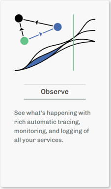

# Istio 소개 - Service Mesh. Simplified.

## Istio란?

Istio는 쿠버네티스 환경에서 마이크로서비스들을 더 쉽고 안전하게 관리할 수 있게 해주는 **서비스 메시(Service Mesh)** 플랫폼이다. 복잡한 클라우드 네이티브 워크로드를 안전하고 신뢰성 있게 구축할 수 있도록 도와주며, 각 애플리케이션 Pod마다 Envoy 프록시 컨테이너(사이드카)가 추가되며 최근에는 효율 극대화를 위해 앰비언트 모드를 지원하기 시작 했다.

> "Istio extends Kubernetes to establish a programmable, application-aware network" - [Istio 공식 사이트](https://istio.io/v1.9/)

## Istio가 필요한 이유

마이크로서비스 아키텍처에서는 수많은 서비스들이 서로 통신한다. 이때 다음과 같은 문제들이 발생할 수 있다

- **보안**: 서비스 간 통신이 안전해야 한다.
- **모니터링**: 어떤 서비스가 어떤 서비스와 통신하는지 알 수 있어야 한다.
- **트래픽 관리**: 새 버전 배포 시 트래픽을 안전하게 전환할 수 있어야 한다.
- **신뢰성**: 서비스 장애 시 자동으로 복구할 수 있어야 한다.

Istio는 이 모든 문제를 편리하게 해결해 준다.

## Istio의 4가지 핵심 특징

    
* 출처 : https://istio.io/v1.9/index.html

### 1. Connect (연결)
**"서비스들을 스마트하게 연결하기"**

- **지능적인 로드 밸런싱**: 트래픽을 여러 서비스 인스턴스에 균등하게 분배
- **서비스 디스커버리**: 새로운 서비스가 추가되면 자동으로 찾아서 연결
- **트래픽 라우팅**: 요청의 특성에 따라 적절한 서비스로 전달

**실생활 예시**: 
음식 배달 앱에서 주문이 들어오면, 주문 서비스 → 결제 서비스 → 배송 서비스 순으로 연결되어야 한다. Istio는 이런 연결을 개발자가 소스코드에 적용하지 않아도 자동으로 관리해준다.

```yaml
# 간단한 트래픽 라우팅 예제
apiVersion: networking.istio.io/v1beta1
kind: VirtualService
metadata:
  name: food-delivery
spec:
  http:
  - match:
    - uri:
        prefix: /api/orders
    route:
    - destination:
        host: order-service
```

### 2. Secure (보안)
**"제로 트러스트 보안 구현"**

- **mTLS (상호 TLS)**: 모든 서비스 간 통신을 자동으로 암호화
- **인증 및 인가**: 누가 어떤 서비스에 접근할 수 있는지 세밀하게 제어
- **보안 정책**: 네트워크 수준에서 보안 규칙 적용

```yaml
# 보안 정책 예제
apiVersion: security.istio.io/v1beta1
kind: AuthorizationPolicy
metadata:
  name: account-access
spec:
  rules:
  - from:
    - source:
        principals: ["cluster.local/ns/default/sa/user-service"]
    to:
    - operation:
        methods: ["GET"]
```

### 3. Control (제어)
**"트래픽을 정밀하게 제어하기"**

- **카나리 배포**: 새 버전을 일부 사용자에게만 먼저 배포
- **블루-그린 배포**: 무중단으로 새 버전으로 전환
- **서킷 브레이커**: 장애 발생 시 자동으로 트래픽 차단
- **재시도 및 타임아웃**: 실패한 요청을 자동으로 재시도

**실사용 예시**: 
쇼핑몰 앱의 새 버전을 배포할 때, 처음에는 5%의 사용자에게만 보여주고 문제가 없으면 점진적으로 100%까지 늘려간다.

```yaml
# 카나리 배포 예제
apiVersion: networking.istio.io/v1beta1
kind: VirtualService
metadata:
  name: shopping-app
spec:
  http:
  - route:
    - destination:
        host: shopping-service
        subset: v1
      weight: 95  # 기존 버전 95%
    - destination:
        host: shopping-service
        subset: v2
      weight: 5   # 새 버전 5%
```

### 4. Observe (관찰)
**"시스템 상태를 한눈에 파악하기"**

- **메트릭 수집**: 응답 시간, 에러율, 처리량 등 자동 수집
- **분산 추적**: 하나의 요청이 여러 서비스를 거치는 전체 경로 추적
- **로깅**: 구조화된 로그 자동 생성
- **시각화**: Grafana, Kiali 등을 통한 직관적인 대시보드

**실사용 예시**: 
사용자가 "로그인이 느려요"라고 불만을 제기했을 때, 로그인 → 인증 → 사용자 정보 조회 → 권한 확인 과정 중 어디서 지연이 발생했는지 수월하게 파악할 수 있다.

## Istio의 주요 구성 요소

### 핵심 아키텍처 구조

**데이터 플레인 (Data Plane)**
- **Envoy 프록시**: 각 서비스 옆에 붙어서 모든 네트워크 통신을 관리하는 "도우미" 역할

**컨트롤 플레인 (Control Plane)**
- **Istiod**: Istio의 "두뇌" 역할을 하는 중앙 제어기

### 핵심 리소스들

1. **Virtual Service**: "이 요청을 어디로 보낼까?"를 결정
2. **Destination Rule**: "목적지에서 어떻게 처리할까?"를 설정
3. **Gateway**: "외부에서 들어오는 요청을 어떻게 받을까?"를 관리
4. **Service Entry**: "외부 서비스도 관리 대상에 포함시키자"

## 실제 도입 효과

### 개발팀 관점
- **비즈니스 로직에 집중**: 네트워킹, 보안 코드를 별도로 작성할 필요 없음
- **일관된 정책**: 모든 서비스에 동일한 보안/모니터링 정책 적용
- **디버깅 용이**: 서비스 간 통신 문제를 쉽게 파악

### 운영팀 관점
- **중앙화된 관리**: 하나의 도구로 모든 서비스 관리
- **자동화된 보안**: 수동 설정 없이 보안 정책 자동 적용
- **실시간 모니터링**: 시스템 상태를 실시간으로 파악

## 시작하기

### 1단계: 환경 준비
```bash
# Kubernetes 클러스터가 필요하다.
kubectl version --short
```

### 2단계: Istio 설치 (예시)
```bash
# istioctl v1.26.2 다운로드
curl -L https://istio.io/downloadIstio | ISTIO_VERSION=1.26.2 TARGET_ARCH=x86_64 sh -
# istio "Symbolic Link" 추가
ln -s istio-1.26.2 istio
# .bashrc에 Istio PATH 등록
vi .bashrc
# 다음 구문 추가
# PATH=/home/vagrant/istio/bin:$PATH
# bash 설정 동기화
source .bashrc
# istio 설치 시도
#vagrant@control-plane1:~$ istioctl install --set profile=demo # istiod, istio-ingressgateway, istio-egressgateway
istioctl install --set profile=default # istiod, istio-ingressgateway
# istio 설치 확인
kubectl get all -o wide -n istio-system
```

### 3단계: 애플리케이션에 적용
```bash
# 해당 네임스페이스에 Istio 활성화
kubectl label namespace egov-app istio-injection=enabled
```

## 결론

Istio는 **"Service Mesh. Simplified."** 라는 슬로건처럼, 복잡한 마이크로서비스 환경을 단순하게 만들어주는 강력한 도구이다. 

**Connect, Secure, Control, Observe**의 4가지 핵심 기능을 통해
- 서비스들을 지능적으로 연결하고
- 자동으로 보안을 적용하며  
- 트래픽을 정밀하게 제어하고
- 시스템 상태를 명확하게 관찰할 수 있다

## 공식 문서 및 커뮤니티

- **Istio 공식 문서 (최신)** : [https://istio.io/latest/docs/](https://istio.io/latest/docs/)
- **Istio 공식 문서 (v1.9)** : [https://istio.io/v1.9/index.html](https://istio.io/v1.9/index.html)
- **커뮤니티** : [Istio Slack](https://istio.slack.com/)

