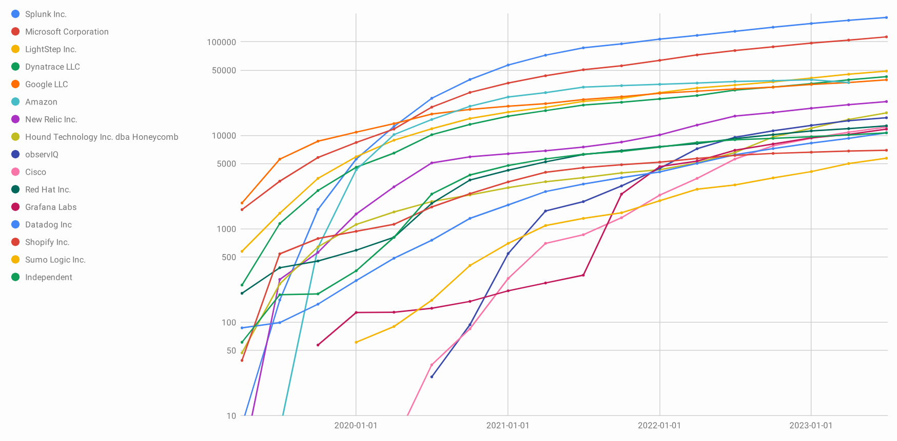

# OpenTelemetry 소개

## OpenTelemetry란?

OpenTelemetry, also known as OTel, is a vendor-neutral open source Observability framework for instrumenting, generating, collecting, and exporting telemetry data such as traces, metrics, and logs. (공식 문서 원문)

**OpenTelemetry**는 애플리케이션의 성능과 동작을 관찰하기 위한 **고품질(high-quality)**, **어디서나 사용 가능한(ubiquitous)**, **이식 가능한(portable)** 텔레메트리 데이터를 생성하고 수집하는 오픈소스 프레임워크이다.

> **텔레메트리(Telemetry)**란?  
> 원격으로 시스템의 상태와 성능을 측정하고 모니터링하는 기술이다. 마치 병원에서 환자의 심박수, 혈압 등을 실시간으로 모니터링하는 것처럼, 소프트웨어 시스템의 '건강 상태'를 지속적으로 관찰할 수 있게 해준다.

### OpenTelemetry의 목표

- **high-quality** : 신뢰도 높은 계측 데이터를 제공 한다.
- **ubiquitous** : 시스템 곳곳에서 손쉽게 수집할 수 있도록 한다.
- **portable** : 어떤 환경·벤더에서도 손쉽게 호환 및 연동 되어 사용할수 있도록 한다.
- 궁극적으로 **운영자가 서비스 상태를 정확히 들여다볼 수 있도록** 한다

## OpenTelemetry의 역사

OpenTelemetry는 다양한 관측 도구들이 통합되어 발전해온 역사를 가지고 있다

| 연도 | 주요 사건 | 설명 |
|------|-----------|------|
| **2015** | <div style="display: flex; align-items: center; gap: 8px; white-space: nowrap;"><strong>Lightstep 설립</strong></div> | Ben Sigelman, Daniel Spoonhower, Ben Cronin이 설립 |
| **2016** | <div style="display: flex; align-items: center; gap: 8px; white-space: nowrap;"><strong>OpenTracing 등장</strong></div> | 분산 추적을 위한 첫 번째 공통 API 표준 |
| **2017** | <div style="display: flex; align-items: center; gap: 8px; white-space: nowrap;"><strong>Jaeger 오픈소스화</strong></div> | Uber에서 개발한 오픈소스 추적 도구 공개 |
| **2018** | <div style="display: flex; align-items: center; gap: 8px; white-space: nowrap;"><strong>OpenCensus 출시</strong></div> | Google에서 새로운 이식 가능한 계측 프로젝트 발표 |
| **2019** | <div style="display: flex; align-items: center; gap: 8px; white-space: nowrap;"><strong>OpenTelemetry 탄생</strong></div> | CNCF의 일원으로 OpenTracing과 OpenCensus 프로젝트 합병 발표 |
| **2020** | <div style="display: flex; align-items: center; gap: 8px; white-space: nowrap;"><strong>베타 버전 출시</strong></div> | OpenTelemetry 베타 버전 릴리스 |

*출처: [OpenTelemetry 공식 사이트](https://opentelemetry.io/), [oicheryl.com](https://www.oicheryl.com/)*

## 관찰가능성의 3요소 (The Three Pillars of Observability)

OpenTelemetry는 **관찰가능성(Observability)**을 위한 3가지 핵심 요소를 제공합니다

### Logs (로그)
```
[2024-01-15 10:30:45] INFO: 사용자 로그인 성공 - user_id: 12345
[2024-01-15 10:30:46] ERROR: 데이터베이스 연결 실패 - timeout after 5s
```
- 시스템 또는 어플리케이션에서 발생하는 이벤트들의 기록
- 에러 발생 원인을 찾거나 특정 시점의 상황을 파악할 때 사용
- **예시:** 로그인 실패, 에러 메시지, 시스템 상태 변화 등

### Tracing (추적)
```
[예시]
사용자 요청(50ms) → API Gateway(20ms) → 인증 서비스(100ms) → 데이터베이스(30ms) → 응답
```
- 하나의 요청이 여러 서비스를 거쳐가는 전체 경로와 소요 시간
- 어느 구간에서 지연이 발생하는지 찾을 때 사용
- **예시:** 웹 페이지 로딩이 느린 원인 분석, 마이크로서비스 간 호출 추적

### Metrics (메트릭)
```
CPU 사용률: 75%
메모리 사용량: 4.2GB / 8GB
초당 요청 수: 1,250 req/s
응답 시간: 평균 120ms
```
- 시스템의 성능과 상태를 숫자로 나타낸 지표
- 시스템의 전반적인 상태를 모니터링할 때 사용
- **예시:** CPU/메모리 사용률, 응답 시간, 에러율, 처리량 등

## OpenTelemetry Zero-code Solutions

**Zero-code Solutions**는 **소스 코드를 전혀 수정하지 않고도** OpenTelemetry의 관측 기능을 애플리케이션에 추가할 수 있는 솔루션이다.

### Zero-code가 필요한 이유

기존 방식의 문제점
- 모든 코드에 관측 로직을 일일이 추가해야 함
- 개발자가 관련 API를 학습해야 함
- 기존 애플리케이션 수정 시 버그 위험
- 배포 과정이 복잡해짐

Zero-code 솔루션의 장점
- **코드 수정 없음**: 기존 애플리케이션을 그대로 사용
- **쉬운 적용**: 에이전트나 설정만으로 관측 기능 활성화
- **안전함**: 기존 코드를 건드리지 않아 안정성 확보
- **빠른 도입**: 즉시 관측 데이터 수집 시작

### 언어별 Zero-code 지원 현황

| 언어 | Traces | Metrics | Logs | Zero-Code 지원 |
|------|--------|---------|------|----------------|
| **C++** | ✅ Stable | ✅ Stable | ✅ Stable |  |
| **C# /.NET** | ✅ Stable | ✅ Stable | ✅ Stable | **Yes** |
| **Erlang / Elixir** | ✅ Stable | 🔄 Development | 🔄 Development |  |
| **Go** | ✅ Stable | ✅ Stable | 🔄 Beta | **Yes** |
| **Java** | ✅ Stable | ✅ Stable | ✅ Stable | **Yes** |
| **JavaScript** | ✅ Stable | ✅ Stable | 🔄 Development | **Yes** |
| **PHP** | ✅ Stable | ✅ Stable | ✅ Stable | **Yes** |
| **Python** | ✅ Stable | ✅ Stable | 🔄 Development | **Yes** |
| **Ruby** | ✅ Stable | 🔄 Development | 🔄 Development |  |
| **Rust** | 🔄 Beta | 🔄 Beta | 🔄 Beta |  |
| **Swift** | ✅ Stable | 🔄 Development | 🔄 Development |  |

> **Zero-Code 미지원 개발언어의 경우**
> 라이브러리 래핑, 최소한의 초기화, 매크로/어노테이션을 코드에 삽입하여 계측을 활성화한다.

### Zero-code 동작 원리

참고로 Java에서 Zero-code 솔루션은 다음 기술을 활용한다.

**바이트코드 조작 (Bytecode Instrumentation)**
   - JVM 기반 언어에서 런타임에 바이트코드를 수정
   - 예: Java Agent를 통한 자동 계측

### OpenTelemetry의 장점

#### 기술적 장점
- **표준화** : 업계 표준을 따라 일관된 관측 방법 제공
- **벤더 중립성** : 특정 벤더에 종속되지 않고 다양한 백엔드 지원
- **언어 지원** : 주요 프로그래밍 언어에 대한 폭넓은 SDK 제공
- **확장성** : 플러그인 아키텍처로 필요에 따라 기능 확장 가능

#### 운영상 장점  
- **통합 관측** : 로그, 메트릭, 트레이스를 하나의 프레임워크로 통합
- **자동 계측** : Zero-code 솔루션으로 코드 수정 없이 관측 가능
- **상관관계 분석** : 서로 다른 텔레메트리 데이터 간 연관성 파악 용이
- **문제 해결 속도 향상** : 분산 시스템에서 병목 지점과 오류 원인을 빠르게 식별

#### 비용 효율성
- **오픈소스** : 라이선스 비용 없이 무료 사용
- **벤더 종속성 방지** : 모니터링 백엔드 변경 시 계측 코드 재작성 불필요
- **운영 비용 절감** : 표준화된 도구로 학습 비용과 유지보수 비용 감소
- **효율적인 리소스 사용** : 샘플링과 필터링으로 불필요한 데이터 수집 최소화

#### 생태계 장점
- **CNCF 프로젝트** : 클라우드 네이티브 생태계의 핵심 구성 요소
- **활발한 커뮤니티** : 지속적인 개발과 개선, 풍부한 문서와 예제
- **기업 지원** : Google, Microsoft, AWS 등 주요 클라우드 업체들의 적극적 지원
- **호환성** : Prometheus, Jaeger, Zipkin 등 기존 도구들과 원활한 연동


### OpenTelemetry 참고자료

#### OpenTelemetry에 기여한 누적 건수
Google, Microsoft, Amazon(AWS) 등 주요 클라우드 업체가 프로젝트 기여 주체

[Project Journey Report](https://www.cncf.io/reports/opentelemetry-project-journey-report/)


## 공식 사이트 및 문서

- [OpenTelemetry 공식 사이트](https://opentelemetry.io/)
- [OpenTelemetry 문서](https://opentelemetry.io/docs/)
- [OpenTelemetry GitHub](https://github.com/open-telemetry)

---

> **결론**  
> OpenTelemetry는 코드 수정 없이도 애플리케이션의 성능과 동작을 관찰할 수 있게 해주는 표준화된 오픈소스 도구이다.