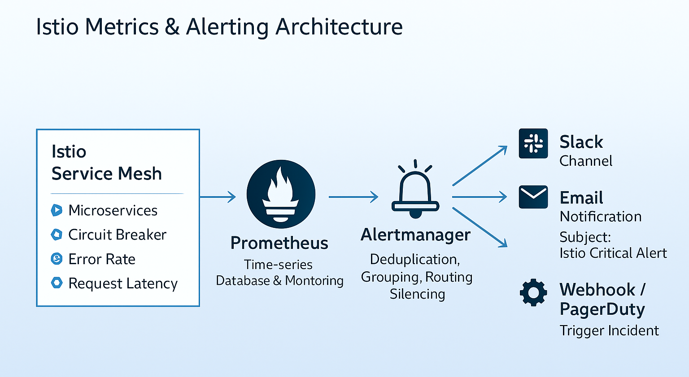

# Istio Alert Manager 가이드

## 개요

이 문서는 eGov MSA 환경에서 Istio 서비스 메시와 Prometheus를 활용한 Alert Manager 설정 및 운영 가이드입니다. Alert Manager는 Prometheus에서 생성된 알림을 관리하고, 다양한 채널을 통해 알림을 전달하는 역할을 합니다.

## 아키텍처



## 주요 구성 요소

### 1. AlertManager 설정 (alertmanager-config.yaml)

AlertManager의 핵심 설정으로 다음 요소들을 포함합니다:

- **Global 설정**: 전역 알림 설정
- **Route 설정**: 알림 라우팅 규칙
- **Receiver 설정**: 알림 전달 채널

### 2. AlertManager 배포 (alertmanager.yaml)

Kubernetes 환경에서 AlertManager를 배포하기 위한 리소스 정의:

- **Deployment**: AlertManager 컨테이너 배포
- **Service**: AlertManager 서비스 노출
- **Volume**: 설정 및 저장소 마운트

### 3. Circuit Breaker 알림 규칙 (circuit-breaker-alerts-configmap.yaml)

Istio 서비스 메시의 Circuit Breaker 상태를 모니터링하는 Prometheus 규칙:

- **알림 조건**: 5xx 오류 3회 이상 발생
- **대상 서비스**: egov-hello 서비스
- **심각도**: Critical

## 상세 설정

### AlertManager 설정 분석

#### Global 설정
```yaml
global:
  resolve_timeout: 5m
  slack_api_url: 'https://hooks.slack.com/services/...'
```

- `resolve_timeout`: 알림 해결 대기 시간 (5분)
- `slack_api_url`: Slack 웹훅 URL

#### 라우팅 규칙
```yaml
route:
  group_by: ['alertname', 'service']
  group_wait: 10s
  group_interval: 10s
  repeat_interval: 1h
  receiver: 'slack-notifications'
  routes:
  - match:
      severity: critical
    receiver: 'slack-notifications'
    continue: true
```

- `group_by`: 알림 그룹화 기준
- `group_wait`: 그룹 대기 시간
- `repeat_interval`: 알림 반복 간격
- `routes`: 심각도별 라우팅 규칙

#### Slack 알림 설정
```yaml
receivers:
- name: 'slack-notifications'
  slack_configs:
  - channel: '#egovalertmanager'
    text: >-
      {{ range .Alerts }}
      *Alert:* {{ .Annotations.summary }}
      *Description:* {{ .Annotations.description }}
      *Service:* {{ .Labels.service }}
      *Severity:* {{ .Labels.severity }}
      *Status:* {{ .Status }}
      {{ end }}
```

### Circuit Breaker 알림 규칙

```yaml
- alert: CircuitBreakerOpen
  expr: |
    sum(increase(istio_requests_total{
      response_code=~"5.*",
      destination_service="egov-hello.egov-app.svc.cluster.local"
    }[5m])) by (destination_service) > 3
  for: 10s
  labels:
    severity: critical
    service: egov-hello
  annotations:
    summary: "Circuit Breaker Opened for egov-hello"
    description: "Circuit Breaker가 Open 되었습니다. 3회 이상의 연속 오류가 발생했습니다."
```

**규칙 설명:**
- **조건**: 5분 내 5xx 오류가 3회 이상 발생
- **지속 시간**: 10초간 지속
- **심각도**: Critical
- **대상**: egov-hello 서비스

## 배포 방법

### 1. 네임스페이스 생성
```bash
kubectl create namespace egov-monitoring
```

### 2. AlertManager 설정 적용
```bash
kubectl apply -f k8s-deploy/manifests/egov-monitoring/alertmanager-config.yaml
```

### 3. AlertManager 배포
```bash
kubectl apply -f k8s-deploy/manifests/egov-monitoring/alertmanager.yaml
```

### 4. Circuit Breaker 알림 규칙 적용
```bash
kubectl apply -f k8s-deploy/manifests/egov-monitoring/circuit-breaker-alerts-configmap.yaml
```

### 5. 배포 상태 확인
```bash
# Pod 상태 확인
kubectl get pods -n egov-monitoring

# 서비스 상태 확인
kubectl get svc -n egov-monitoring

# 설정 확인
kubectl get secret alertmanager-config -n egov-monitoring -o yaml
```

## 접근 방법

### AlertManager 웹 UI 접근
```bash
# NodePort를 통한 접근
kubectl get svc alertmanager -n egov-monitoring

# 포트 포워딩을 통한 접근
kubectl port-forward svc/alertmanager 9093:9093 -n egov-monitoring
```

접속 URL: `http://localhost:9093` 또는 `http://<NodeIP>:31093`


## 모니터링 및 관리

### 1. 알림 상태 확인
- AlertManager 웹 UI에서 활성 알림 확인
- 알림 그룹 및 라벨별 필터링 가능

### 2. 알림 테스트
```bash
# 테스트 알림 전송
curl -X POST http://localhost:9093/api/v1/alerts \
  -H "Content-Type: application/json" \
  -d '[{
    "labels": {
      "alertname": "TestAlert",
      "service": "test-service",
      "severity": "critical"
    },
    "annotations": {
      "summary": "Test Alert",
      "description": "This is a test alert"
    }
  }]'
```

### 3. 로그 확인
```bash
# AlertManager 로그 확인
kubectl logs -f deployment/alertmanager -n egov-monitoring
```

## 커스터마이징

### 1. 추가 알림 규칙 생성

새로운 서비스에 대한 Circuit Breaker 알림 규칙 추가:

```yaml
apiVersion: v1
kind: ConfigMap
metadata:
  name: prometheus-rules
  namespace: egov-monitoring
data:
  additional-alerts.yaml: |
    groups:
    - name: AdditionalAlerts
      rules:
      - alert: HighErrorRate
        expr: |
          rate(istio_requests_total{
            response_code=~"5.*"
          }[5m]) > 0.1
        for: 2m
        labels:
          severity: warning
        annotations:
          summary: "High Error Rate Detected"
          description: "Error rate is above 10% for the last 5 minutes"
```

### 2. 이메일 알림 추가

Slack 외에 이메일 알림을 추가하려면 `alertmanager-config.yaml`을 수정:

```yaml
receivers:
- name: 'email-notifications'
  email_configs:
  - to: 'admin@example.com'
    subject: 'eGov Alert: {{ .GroupLabels.alertname }}'
    body: |
      {{ range .Alerts }}
      Alert: {{ .Annotations.summary }}
      Description: {{ .Annotations.description }}
      {{ end }}
```

### 3. 추가 채널 설정

웹훅, PagerDuty 등 다른 알림 채널 추가 가능:

```yaml
receivers:
- name: 'webhook-notifications'
  webhook_configs:
  - url: 'https://your-webhook-url.com/alerts'
    send_resolved: true
```

## 트러블슈팅

### 1. 알림이 전송되지 않는 경우

**확인 사항:**
- Slack 웹훅 URL이 올바른지 확인
- AlertManager가 정상 실행 중인지 확인
- Prometheus가 AlertManager로 알림을 전송하는지 확인

**해결 방법:**
```bash
# AlertManager 로그 확인
kubectl logs -f deployment/alertmanager -n egov-monitoring

# 설정 재로드
kubectl rollout restart deployment/alertmanager -n egov-monitoring
```

### 2. Circuit Breaker 알림이 발생하지 않는 경우

**확인 사항:**
- Prometheus가 Istio 메트릭을 수집하고 있는지 확인
- 서비스명이 정확한지 확인
- 알림 규칙의 임계값이 적절한지 확인

**해결 방법:**
```bash
# Prometheus 규칙 확인
kubectl get configmap prometheus-rules -n egov-monitoring -o yaml

# Istio 메트릭 확인
kubectl exec -it deployment/prometheus -n egov-monitoring -- \
  curl 'http://localhost:9090/api/v1/query?query=istio_requests_total'
```

### 3. 성능 최적화

**알림 그룹화 최적화:**
- `group_wait`과 `group_interval` 조정
- 불필요한 알림 필터링

**리소스 최적화:**
- AlertManager 메모리 및 CPU 제한 설정
- 저장소 볼륨 크기 조정

## 보안 고려사항

### 1. 민감한 정보 보호
- Slack 웹훅 URL을 Secret으로 관리
- 알림에 민감한 정보 포함 금지

### 2. 접근 제어
- AlertManager 웹 UI 접근 제한
- RBAC 설정을 통한 권한 관리

### 3. 네트워크 보안
- 필요한 포트만 노출
- 내부 네트워크 통신 암호화

## 모니터링 대시보드

### Grafana 대시보드 설정
AlertManager와 연동된 Grafana 대시보드를 구성하여 다음 정보를 시각화:

- 알림 발생 현황
- 서비스별 오류율
- Circuit Breaker 상태
- 알림 해결 시간

## 결론

이 가이드를 통해 eGov MSA 환경에서 Istio와 AlertManager를 활용한 효과적인 모니터링 시스템을 구축할 수 있습니다. 정기적인 모니터링과 알림 규칙의 최적화를 통해 안정적인 서비스 운영을 보장할 수 있습니다.

## 참고 자료

- [Prometheus AlertManager 공식 문서](https://prometheus.io/docs/alerting/latest/alertmanager/)

