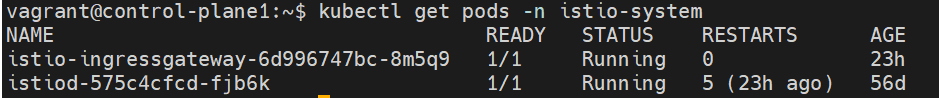
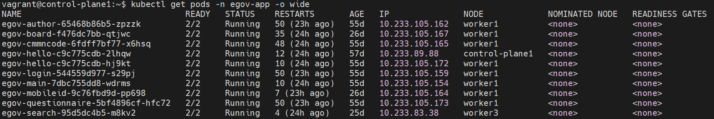

# Istio 구성 내용

## 개요

본 프로젝트에서는 Kubernetes 환경에서 마이크로서비스 간 통신, 보안, 모니터링을 위해 Istio Service Mesh를 구성하고 있다. 이 문서는 현재 프로젝트에 적용된 Istio 구성 내용을 상세히 설명한다.

## 1. Istio 버전

### 사용 버전
- **Kubernetes**: 1.32.5
- **Istio**: 1.26.2

### 버전 확인
```bash
# Kubernetes, Istio 버전 확인
kubectl version --short
istioctl version
```

## 2. Istio 설치 및 초기 구성

### 2.1 네임스페이스 생성
```bash
kubectl create namespace istio-system
```

### 2.2 Istio 바이너리 설치
```bash
# 특정 버전 다운로드
curl -L https://istio.io/downloadIstio | ISTIO_VERSION=1.26.2 TARGET_ARCH=amd64 sh -

# PATH 설정
export PATH=$PWD/istio-1.26.2/bin:$PATH
```

### 2.3 Istio 설치
```bash
# Default 프로파일로 설치 (istiod + istio-ingressgateway)
istioctl install --set profile=default -y

# 설치 확인
istioctl version
kubectl get pods -n istio-system
```

## 3. 핵심 구성 파일

### 3.1 Istio ConfigMap (`k8s-deploy/manifests/egov-istio/config.yaml`)

```yaml
apiVersion: v1
kind: ConfigMap
metadata:
  name: istio
  namespace: istio-system
data:
  mesh: |-
    # 액세스 로그를 표준 출력으로 설정
    accessLogFile: /dev/stdout
    
    defaultConfig:
      # Istiod 디스커버리 주소
      discoveryAddress: istiod.istio-system.svc:15012
      
      # 분산 추적 설정
      tracing:
        sampling: 100.0  # 100% 샘플링
        custom_tags:
          environment:
            literal:
              value: "egov-cluster"
    
    # Prometheus 메트릭 통합
    enablePrometheusMerge: true
    
    # 확장 프로바이더 설정
    extensionProviders:
    # OpenTelemetry 추적 설정
    - name: otel-tracing
      opentelemetry:
        service: otel-collector.egov-monitoring.svc.cluster.local
        port: 4317
    
    # Loki 로깅 설정
    - name: otel-loki
      envoyOtelAls:
        service: otel-collector.egov-monitoring.svc.cluster.local
        port: 4317
        logFormat:
          labels:
            pod: "%ENVIRONMENT(POD_NAME)%"
            namespace: "%ENVIRONMENT(POD_NAMESPACE)%"
            app: "%ENVIRONMENT(APP_CONTAINER_NAME)%"
            instance: "%ENVIRONMENT(HOSTNAME)%"
            version: "%ENVIRONMENT(POD_VERSION)%"
            cluster_name: "egov-cluster"
            log_type: "access-log"
    
    # 루트 네임스페이스 및 신뢰 도메인
    rootNamespace: istio-system
    trustDomain: cluster.local
```

### 3.2 사이드카 주입 설정

```bash
# 애플리케이션 네임스페이스에 Istio 주입 활성화
kubectl label namespace egov-app istio-injection=enabled --overwrite
kubectl label namespace egov-infra istio-injection=enabled --overwrite

# 주입 확인
kubectl get namespace -L istio-injection
```

## 4. 트래픽 관리 구성

### 4.1 Gateway 설정 (`k8s-deploy/manifests/istio-system/gateway.yaml`)

```yaml
apiVersion: networking.istio.io/v1beta1
kind: Gateway
metadata:
  name: istio-ingressgateway
  namespace: istio-system
spec:
  selector:
    istio: ingressgateway
  servers:
  - port:
      number: 80
      name: http
      protocol: HTTP
    hosts:
    - "*"  # 모든 호스트 허용
```

**주요 기능:**
- 외부 트래픽을 클러스터 내부로 라우팅
- HTTP 프로토콜 지원 (포트 80)
- 모든 호스트명 허용

### 4.2 VirtualService 설정 (`k8s-deploy/manifests/egov-app/virtual-services.yaml`)

```yaml
apiVersion: networking.istio.io/v1beta1
kind: VirtualService
metadata:
  name: egov-hello
  namespace: egov-app
spec:
  hosts:
  - "*"
  gateways:
  - istio-system/istio-ingressgateway
  http:
  - match:
    - uri:
        prefix: /a/b/c/hello  # URL 패스 매칭
    route:
    - destination:
        host: egov-hello
        port:
          number: 80
```

**주요 기능:**
- URL 기반 라우팅 규칙 정의
- Gateway와 연동하여 외부 요청 처리
- 서비스별 라우팅 경로 설정

### 4.3 DestinationRule 설정 (`k8s-deploy/manifests/egov-app/destination-rules.yaml`)

```yaml
apiVersion: networking.istio.io/v1beta1
kind: DestinationRule
metadata:
  name: egov-hello
  namespace: egov-app
spec:
  host: egov-hello
  trafficPolicy:
    # 로드 밸런싱 설정
    loadBalancer:
      simple: ROUND_ROBIN
    
    # 서킷 브레이커 설정
    outlierDetection:
      interval: 1s                    # 장애 감지 주기
      consecutive5xxErrors: 3         # 연속 오류 임계값
      baseEjectionTime: 30s          # 제외 시간
      maxEjectionPercent: 100        # 최대 제외 비율
```

**주요 기능:**
- **로드 밸런싱**: Round Robin 알고리즘으로 트래픽 분산
- **서킷 브레이커**: 장애 인스턴스 자동 제외
- **장애 복구**: 30초 후 자동 재시도

## 5. 관찰가능성(Observability) 구성

### 5.1 Telemetry 설정 (`k8s-deploy/manifests/egov-istio/telemetry.yaml`)

```yaml
apiVersion: telemetry.istio.io/v1alpha1
kind: Telemetry
metadata:
  name: egov-apps-telemetry
  namespace: egov-app
spec:
  # 액세스 로깅
  accessLogging:
    - providers:
      - name: otel-loki
  
  # 분산 추적
  tracing:
    - randomSamplingPercentage: 100.0  # 100% 샘플링
      providers:
        - name: "otel-tracing"
      customTags:
        environment:
          environment:
            name: SPRING_PROFILES_ACTIVE
            defaultValue: "unknown"
        cluster:
          literal:
            value: "egov-cluster"
        version:
          header:
            name: x-version
            defaultValue: "unknown"
  
  # 메트릭 수집
  metrics:
    - providers:
        - name: prometheus
```

### 5.2 모니터링 통합

**연동 도구:**
- **Prometheus**: 메트릭 수집 및 저장
- **Grafana**: 메트릭 시각화 및 대시보드
- **Jaeger**: 분산 추적 시각화
- **Kiali**: 서비스 메시 토폴로지 시각화
- **Loki**: 로그 수집 및 저장

**OpenTelemetry 수집기 연동:**
- 서비스: `otel-collector.egov-monitoring.svc.cluster.local:4317`
- 프로토콜: gRPC (OpenTelemetry Protocol)

## 6. 보안 구성

### 6.1 mTLS (상호 TLS)
```bash
# mTLS 상태 확인
istioctl authn tls-check <pod-name>.<namespace>

# 전체 메시에서 mTLS 강제 적용
kubectl apply -f - <<EOF
apiVersion: security.istio.io/v1beta1
kind: PeerAuthentication
metadata:
  name: default
  namespace: istio-system
spec:
  mtls:
    mode: STRICT
EOF
```

### 6.2 도메인 및 인증서
- Trust Domain : `cluster.local`
- Istio Namespace : `istio-system`
- mTLS(워크로드↔워크로드) 인증서는 Istio 자체적으로 자동 인증서 관리 (워크로드는 애플리케이션의 실행 인스턴스)


## 7. 배포 및 관리 스크립트

### 7.1 자동 설치 스크립트
```bash
# Istio 설치 스크립트
./k8s-deploy/scripts/setup/01-setup-istio.sh
```

### 7.2 구성 적용
```bash
# ConfigMap 배포
kubectl apply -f k8s-deploy/manifests/egov-istio/config.yaml

# OpenTelemetry 설정 적용
kubectl apply -f k8s-deploy/manifests/egov-istio/telemetry.yaml

# Gateway 및 VirtualService 적용
kubectl apply -f k8s-deploy/manifests/istio-system/gateway.yaml
kubectl apply -f k8s-deploy/manifests/egov-app/virtual-services.yaml
kubectl apply -f k8s-deploy/manifests/egov-app/destination-rules.yaml
```

## 8. 운영 및 모니터링

### 8.1 상태 확인
```bash
# Istio 구성 요소 상태
kubectl get pods -n istio-system

# 사이드카 주입 확인
kubectl get pods -n egov-app -o wide

# 프록시 상태 확인
istioctl proxy-status
```




### 8.2 설정 검증
```bash
# 구성 검증
istioctl analyze

# VirtualService 확인
istioctl proxy-config route <pod-name>.<namespace>

# DestinationRule 확인
istioctl proxy-config cluster <pod-name>.<namespace>
```

### 8.3 트래픽 분석
```bash
# 트래픽 정책 확인
istioctl proxy-config listeners <pod-name>.<namespace>

# 엔드포인트 확인
istioctl proxy-config endpoints <pod-name>.<namespace>
```

## 9. 문제 해결

### 9.1 일반적인 문제
- **사이드카 주입 실패**: 네임스페이스 레이블 확인
- **트래픽 라우팅 실패**: VirtualService 규칙 검증
- **서킷 브레이커 동작**: DestinationRule 설정 확인

### 9.2 디버깅 명령어
```bash
# 프록시 로그 확인
kubectl logs <pod-name> -c istio-proxy -n <namespace>

# Envoy 설정 덤프
istioctl proxy-config dump <pod-name>.<namespace>

# 메트릭 확인
kubectl exec <pod-name> -c istio-proxy -- curl localhost:15000/stats
```

## 10. 참고 자료

- [Istio 공식 문서](https://istio.io/latest/docs/)
- [프로젝트 Istio 가이드](/doc/kubernetes/istio.md)
- [Istio 소개 문서](/doc/intro/istio.md)
- [Kubernetes 배포 가이드](/k8s-deploy/MSA-공통컴포넌트-쿠버네티스-배포-가이드.md)

---
*이 문서는 eGovFrame MSA 프로젝트의 Istio 구성을 기준으로 작성되었다.*
