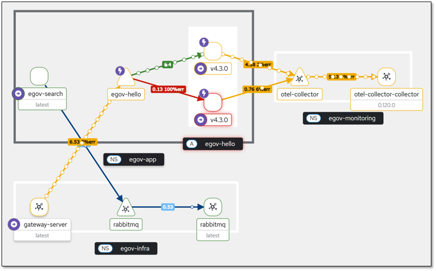

# Istio 트래픽 정책

## 개요

본 프로젝트에서는 Kubernetes 환경에서 마이크로서비스 간 통신, 보안, 모니터링을 위해 Istio Service Mesh를 구성하고 있다. 이 문서는 현재 프로젝트에 적용된 Istio 구성 내용을 상세히 설명한다.

## 1. Gateway 설정

### 1.1 Istio Gateway
외부 트래픽이 클러스터로 진입하는 진입점을 정의한다.

```yaml
apiVersion: networking.istio.io/v1beta1
kind: Gateway
metadata:
  name: istio-ingressgateway
  namespace: istio-system
spec:
  selector:
    istio: ingressgateway
  servers:
  - port:
      number: 80
      name: http
      protocol: HTTP
    hosts:
    - "*"
```

**설명:**
- `selector`: Gateway가 동작할 Pod를 선택하는 라벨
- `servers`: 수신할 포트와 프로토콜 정의
- `hosts: "*"`: 모든 호스트에서의 접근 허용

### 1.2 Gateway Service
Gateway를 외부에서 접근할 수 있도록 NodePort 서비스로 노출한다.

```yaml
apiVersion: v1
kind: Service
metadata:
  name: istio-ingressgateway
  namespace: istio-system
spec:
  type: NodePort
  selector:
    istio: ingressgateway
  ports:
    - name: http2
      port: 80
      targetPort: 8080
      nodePort: 30622  # 원하는 포트 지정
```

**설명:**
- `type: NodePort`: 외부에서 접근 가능한 서비스 타입
- `nodePort: 30622`: 외부에서 접근할 포트 번호
- `targetPort: 8080`: Gateway Pod의 실제 포트

## 2. 라우팅 설정

### 2.1 VirtualService
들어오는 요청을 적절한 서비스로 라우팅하는 규칙을 정의한다.

```yaml
apiVersion: networking.istio.io/v1beta1
kind: VirtualService
metadata:
  name: egov-hello
  namespace: egov-app
spec:
  hosts:
  - "*"
  gateways:
  - istio-system/istio-ingressgateway
  http:
  - match:
    - uri:
        prefix: /a/b/c/hello
    route:
    - destination:
        host: egov-hello
        port:
          number: 80
```

**설명:**
- `hosts: "*"`: 모든 호스트에서의 요청 처리
- `gateways`: 사용할 Gateway 지정
- `match.uri.prefix`: URL 패턴 매칭
- `destination`: 라우팅할 대상 서비스

## 3. 트래픽 정책 설정

### 3.1 DestinationRule - Circuit Breaking
서비스의 안정성을 위한 Circuit Breaking 설정을 정의한다.

```yaml
apiVersion: networking.istio.io/v1beta1
kind: DestinationRule
metadata:
  name: egov-hello
  namespace: egov-app
spec:
  host: egov-hello
  trafficPolicy:
    loadBalancer:
      simple: ROUND_ROBIN    # 로드밸런싱 알고리즘
    outlierDetection:       # Circuit Breaking 설정
      interval: 1s         # 장애 감지 주기
      consecutive5xxErrors: 3  # 연속 5xx 에러 발생 시 제외
      baseEjectionTime: 30s  # 인스턴스 제외 기본 시간
      maxEjectionPercent: 100 # 최대 제외 가능한 Pod 비율
```

**설명:**
- `loadBalancer.simple: ROUND_ROBIN`: 라운드 로빈 방식으로 로드밸런싱
- `outlierDetection.interval: 1s`: 1초마다 장애 상태 체크
- `consecutive5xxErrors: 3`: 연속 3번의 5xx 에러 발생 시 해당 Pod 제외
- `baseEjectionTime: 30s`: 제외된 Pod가 30초 후 다시 트래픽 처리 가능
- `maxEjectionPercent: 100`: 최대 100%까지 Pod 제외 가능

### 3.2 성능 최적화 설정 (참고용)
향후 적용할 수 있는 추가 성능 최적화 설정들이다.

#### 연결 풀 설정
```yaml
trafficPolicy:
  connectionPool:
    tcp:
      maxConnections: 100
    http:
      http1MaxPendingRequests: 1 # 대기열에 쌓아둘 수 있는 요청 수의 최대값
      maxRequestsPerConnection: 1 # 처리할 수 있는 요청의 누적 최대 개수
```

#### 타임아웃 및 재시도
```yaml
trafficPolicy:
  timeout: 10s # 요청에 대한 시간 제한 (재시도 포함)
  retryPolicy:
    attempts: 3 # 최대 재시도 횟수
    perTryTimeout: 3s # 재시도 시간 제한 (제한 시간 넘기면 실패로 간주)
```

## 4. 트래픽 흐름

```
외부 클라이언트 → NodePort:30622 → Gateway Service → Istio Gateway → VirtualService → DestinationRule → Target Service
```

1. **외부 접근**: 클라이언트가 `http://<node-ip>:30622`로 접근
2. **Gateway Service**: NodePort를 통해 Istio Gateway로 트래픽 전달
3. **Istio Gateway**: HTTP 포트 80에서 트래픽 수신
4. **VirtualService**: URL 패턴(`/a/b/c/hello`)에 따라 `egov-hello` 서비스로 라우팅
5. **DestinationRule**: Circuit Breaking 및 로드밸런싱 정책 적용
6. **Target Service**: 최종적으로 `egov-hello` 서비스의 Pod로 트래픽 전달



## 5. 모니터링 및 디버깅

### 5.1 Istio 상태 확인
```bash
# Gateway 상태 확인
kubectl get gateway -n istio-system

# VirtualService 상태 확인
kubectl get virtualservice -n egov-app

# DestinationRule 상태 확인
kubectl get destinationrule -n egov-app
```

### 5.2 트래픽 흐름 확인
```bash
# Istio 프록시 로그 확인
kubectl logs -f deployment/istio-ingressgateway -n istio-system

# 애플리케이션 Pod 로그 확인
kubectl logs -f deployment/egov-hello -n egov-app
```

## 6. 주의사항

1. **네임스페이스**: Gateway는 `istio-system`, 애플리케이션 관련 리소스는 `egov-app` 네임스페이스에 배포
2. **Circuit Breaking**: `maxEjectionPercent: 100` 설정으로 인해 모든 Pod가 제외될 수 있으므로 주의
3. **포트 충돌**: NodePort 30622가 다른 서비스와 충돌하지 않는지 확인
4. **보안**: 프로덕션 환경에서는 `hosts: "*"` 대신 특정 도메인을 지정하는 것을 권장

