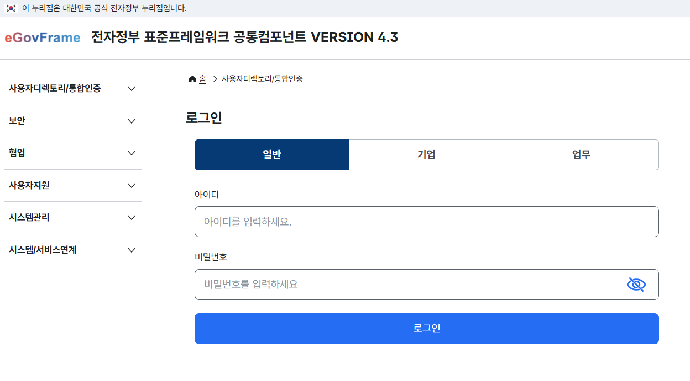
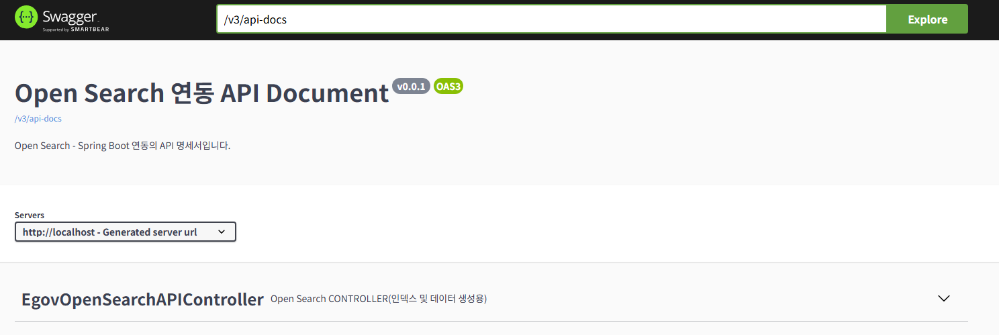
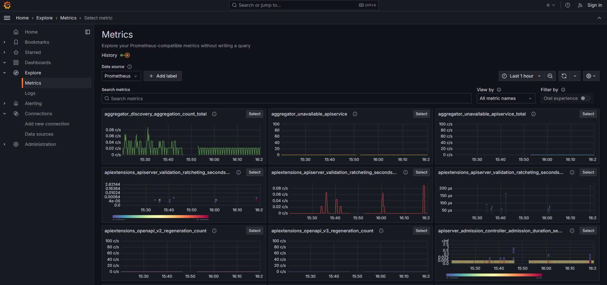
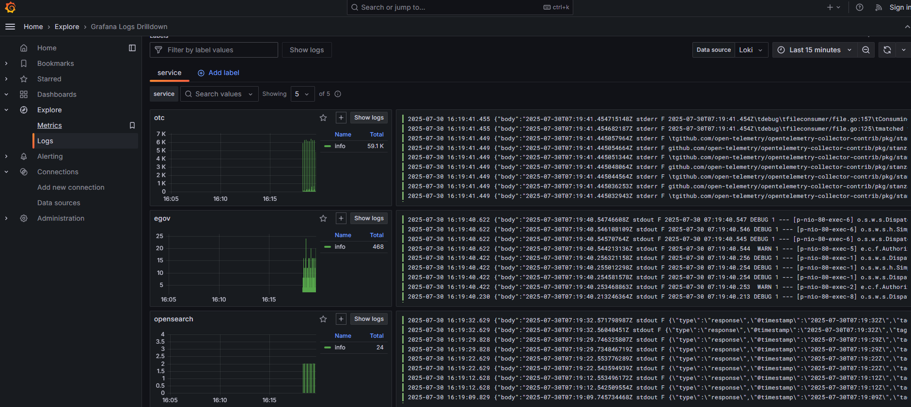
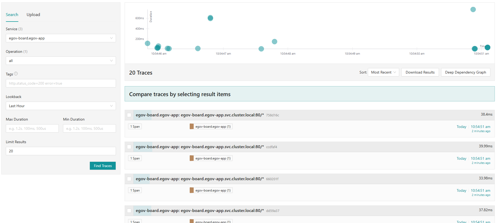

## Application 구성 및 배포
### 1. Mysql Secret 복사
```bash
kubectl get secret mysql-secret -n egov-db -o yaml | sed 's/namespace: egov-db/namespace: egov-app/' | kubectl apply -f -
```

### 2. FileUpload pv 생성
```bash
kubectl apply -f ~/egovframe-operating-environment-msa/k8s-deploy/manifests/egov-app/egov-fileupload-pvc-nfs.yaml
```

### 3. Appliation 서비스 배포
```bash
#메인 레이아웃
kubectl apply -f ~/egovframe-operating-environment-msa/k8s-deploy/manifests/egov-app/egov-main-deployment.yaml
#게시판 (egov-board)
kubectl apply -f ~/egovframe-operating-environment-msa/k8s-deploy/manifests/egov-app/egov-board-deployment.yaml
#로그인 (egov-login)
kubectl apply -f ~/egovframe-operating-environment-msa/k8s-deploy/manifests/egov-app/egov-login-deployment.yaml
#로그인 정책 (loginPolicy)
kubectl apply -f ~/egovframe-operating-environment-msa/k8s-deploy/manifests/egov-app/egov-loginpolicy-deployment.yaml
#권한 (egov-author)
kubectl apply -f ~/egovframe-operating-environment-msa/k8s-deploy/manifests/egov-app/egov-author-deployment.yaml
#설문 (egov-questionnaire)
kubectl apply -f ~/egovframe-operating-environment-msa/k8s-deploy/manifests/egov-app/egov-questionnaire-deployment.yaml
#공통코드 (egov-cmmncode)
kubectl apply -f ~/egovframe-operating-environment-msa/k8s-deploy/manifests/egov-app/egov-cmmncode-deployment.yaml
```
#### 4) EgovSearch
*EgovSearch를 사용하는 경우 서버구성 등에 관련된 사항은 [EgovSearch 가이드](https://github.com/eGovFramework/egovframe-common-components-msa-krds/blob/main/EgovSearch/README.md) 를 참조하시기 바랍니다.

#### 5) EgovMobileId

*EgovMobileId 사용하는 경우 서버구성 등에 관련된 사항은 [EgovMobileId 가이드](https://github.com/eGovFramework/egovframe-common-components-msa-krds/blob/main/EgovMobileId/README.md) 를 참조하시기 바랍니다.

### 9. 실행 확인

| 서비스 | 포트 |기타|
|---|---|---|
|EgovSearch Swagger UI|30992|swagger-ui.html|
|EgovMain|9000|main|
|Kiali|30001|
|Grafana|30002|
|Jaeger|30003|

- 전체 Pod 실행현황
```text
NAMESPACE                       NAME                                                             READY   STATUS             RESTARTS         AGE
cert-manager                    pod/cert-manager-58f8dcbb68-rfdcz                                1/1     Running            1 (172m ago)     3h3m
cert-manager                    pod/cert-manager-cainjector-7588b6f5cc-rwmtk                     1/1     Running            1 (172m ago)     3h3m
cert-manager                    pod/cert-manager-webhook-768c67c955-6txzp                        1/1     Running            1 (172m ago)     3h3m
egov-app                        pod/egov-author-d776b7d94-gglgg                                  2/2     Running            2 (172m ago)     3h
egov-app                        pod/egov-board-5ddd8fd49f-h74tt                                  2/2     Running            3 (172m ago)     3h
egov-app                        pod/egov-cmmncode-6fdff7bf77-ttcq9                               2/2     Running            2 (172m ago)     3h
egov-app                        pod/egov-login-54fc775fb-m8d6q                                   2/2     Running            2 (172m ago)     3h
egov-app                        pod/egov-loginpolicy-5dc59488b-h9kzt                             2/2     Running            2 (172m ago)     3h
egov-app                        pod/egov-main-7cf89848bc-tslw8                                   2/2     Running            2 (172m ago)     3h
egov-app                        pod/egov-questionnaire-6fc65c7ff6-t48m6                          2/2     Running            2 (172m ago)     3h
egov-db                         pod/mysql-0                                                      1/1     Running            1 (172m ago)     3h2m
egov-db                         pod/opensearch-0                                                 1/1     Running            1 (172m ago)     3h2m
egov-db                         pod/opensearch-dashboards-78456d9886-7vb8v                       1/1     Running            1 (172m ago)     3h2m
egov-infra                      pod/gateway-server-7584c4ccb6-7sc6l                              2/2     Running            5 (172m ago)     3h1m
egov-infra                      pod/rabbitmq-7f757db777-z77cz                                    2/2     Running            2 (172m ago)     3h1m
egov-monitoring                 pod/alertmanager-56654fc956-h6lcb                                1/1     Running            1 (172m ago)     3h2m
egov-monitoring                 pod/grafana-65bfb5f855-wz99k                                     1/1     Running            1 (172m ago)     3h2m
egov-monitoring                 pod/jaeger-5b6b9dd97f-zf6d7                                      1/1     Running            1 (172m ago)     3h2m
egov-monitoring                 pod/kiali-cd56bb865-rlqwm                                        1/1     Running            1 (172m ago)     3h2m
egov-monitoring                 pod/loki-db957875-2bt9g                                          1/1     Running            1 (172m ago)     3h2m
egov-monitoring                 pod/otel-collector-collector-bp8bl                               1/1     Running            1 (172m ago)     3h2m
egov-monitoring                 pod/otel-collector-collector-vwxvv                               1/1     Running            1 (173m ago)     3h2m
egov-monitoring                 pod/prometheus-59c47447b5-98qnv                                  1/1     Running            1 (172m ago)     3h2m
egov-storage                    pod/nfs-provisioner-deployment-7f8cd54547-f6htv                  1/1     Running            14 (172m ago)    43h
istio-system                    pod/istio-ingressgateway-6d996747bc-lk8hf                        1/1     Running            16 (172m ago)    38d
istio-system                    pod/istiod-6f9f94568-s7p6j                                       1/1     Running            2 (172m ago)     21h
opentelemetry-operator-system   pod/opentelemetry-operator-controller-manager-6856674db7-h5sgd   2/2     Running            2 (172m ago)     3h2m
```

- 서비스 실행현황
```text
NAMESPACE                       NAME                                                                TYPE           CLUSTER-IP      EXTERNAL-IP   PORT(S)                                          AGE
cert-manager                    service/cert-manager                                                ClusterIP      10.233.54.19    <none>        9402/TCP                                         3h3m
cert-manager                    service/cert-manager-webhook                                        ClusterIP      10.233.55.44    <none>        443/TCP                                          3h3m
egov-app                        service/egov-author                                                 ClusterIP      10.233.59.89    <none>        80/TCP                                           3h
egov-app                        service/egov-board                                                  ClusterIP      10.233.20.28    <none>        80/TCP                                           3h
egov-app                        service/egov-cmmncode                                               ClusterIP      10.233.27.252   <none>        80/TCP                                           3h
egov-app                        service/egov-login                                                  ClusterIP      10.233.36.140   <none>        80/TCP                                           3h
egov-app                        service/egov-loginpolicy                                            ClusterIP      10.233.43.53    <none>        80/TCP                                           3h
egov-app                        service/egov-main                                                   ClusterIP      10.233.34.83    <none>        80/TCP                                           3h
egov-app                        service/egov-questionnaire                                          ClusterIP      10.233.46.92    <none>        80/TCP                                           3h
egov-db                         service/mysql                                                       NodePort       10.233.29.214   <none>        3306:30306/TCP                                   3h2m
egov-db                         service/mysql-headless                                              ClusterIP      None            <none>        3306/TCP                                         3h2m
egov-db                         service/opensearch                                                  NodePort       10.233.17.254   <none>        9200:30920/TCP,9600:30960/TCP                    3h2m
egov-db                         service/opensearch-dashboards                                       NodePort       10.233.29.84    <none>        5601:30561/TCP                                   3h2m
egov-db                         service/opensearch-headless                                         ClusterIP      None            <none>        9200/TCP                                         3h2m
egov-infra                      service/gateway-server                                              LoadBalancer   10.233.22.71    <pending>     9000:30090/TCP                                   3h1m
egov-infra                      service/rabbitmq                                                    NodePort       10.233.7.114    <none>        5672:30672/TCP,15672:31672/TCP                   3h1m
egov-monitoring                 service/alertmanager                                                NodePort       10.233.14.241   <none>        9093:31093/TCP                                   3h2m
egov-monitoring                 service/grafana                                                     NodePort       10.233.43.136   <none>        3000:30002/TCP                                   3h2m
egov-monitoring                 service/jaeger-collector                                            ClusterIP      10.233.27.94    <none>        14268/TCP,14250/TCP,9411/TCP,4317/TCP,4318/TCP   3h2m
egov-monitoring                 service/kiali                                                       NodePort       10.233.45.236   <none>        20001:30001/TCP,9090:30289/TCP                   3h2m
egov-monitoring                 service/loki                                                        ClusterIP      10.233.55.22    <none>        3100/TCP                                         3h2m
egov-monitoring                 service/otel-collector                                              ClusterIP      10.233.10.207   <none>        4317/TCP,4318/TCP,8889/TCP                       3h2m
egov-monitoring                 service/otel-collector-collector                                    ClusterIP      10.233.5.220    <none>        4317/TCP,4318/TCP,8889/TCP                       3h2m
egov-monitoring                 service/otel-collector-collector-headless                           ClusterIP      None            <none>        4317/TCP,4318/TCP,8889/TCP                       3h2m
egov-monitoring                 service/otel-collector-collector-monitoring                         ClusterIP      10.233.23.72    <none>        8888/TCP                                         3h2m
egov-monitoring                 service/prometheus                                                  NodePort       10.233.32.216   <none>        9090:30004/TCP                                   3h2m
egov-monitoring                 service/tracing                                                     NodePort       10.233.39.60    <none>        80:30003/TCP,16685:30439/TCP                     3h2m
egov-monitoring                 service/zipkin                                                      ClusterIP      10.233.8.15     <none>        9411/TCP                                         3h2m
istio-system                    service/istio-ingressgateway                                        LoadBalancer   10.233.7.244    <pending>     15021:30423/TCP,80:30622/TCP,443:30581/TCP       38d
istio-system                    service/istiod                                                      ClusterIP      10.233.13.172   <none>        15010/TCP,15012/TCP,443/TCP,15014/TCP            38d
opentelemetry-operator-system   service/opentelemetry-operator-controller-manager-metrics-service   ClusterIP      10.233.39.216   <none>        8443/TCP                                         3h2m
opentelemetry-operator-system   service/opentelemetry-operator-webhook-service                      ClusterIP      10.233.30.235   <none>        443/TCP                                          3h2m

```


#### 1) MSA 서비스
- Pod 실행현황
```text
NAME                                      READY   STATUS             RESTARTS       AGE
pod/egov-author-d776b7d94-gglgg           2/2     Running            2 (161m ago)   168m
pod/egov-board-5ddd8fd49f-h74tt           2/2     Running            3 (161m ago)   168m
pod/egov-cmmncode-6fdff7bf77-ttcq9        2/2     Running            2 (161m ago)   168m
pod/egov-login-54fc775fb-m8d6q            2/2     Running            2 (84s ago)    168m
pod/egov-loginpolicy-5dc59488b-h9kzt      2/2     Running            2 (161m ago)   168m
pod/egov-main-7cf89848bc-tslw8            2/2     Running            2 (161m ago)   168m
pod/egov-questionnaire-6fc65c7ff6-t48m6   2/2     Running            2 (161m ago)   168m
```
- 실행화면
   
   - http://xxx.xxx.xxx.xx:9000
   - 로그인 계정
      - 일반 계정 : USER/rhdxhd12
      - 업무 계정: TEST1/rhdxhd12

#### 2) Swagger 서비스

ex) http://xxx.xxx.xxx.xxx:30992/swagger-ui.html
   - egov-search의 swagger 서비스 : [OpenSearch 관련 API 설명](https://github.com/eGovFramework/egovframe-common-components-msa-krds/tree/main/EgovSearch#open-search-%EA%B4%80%EB%A0%A8-api-%EC%84%A4%EB%AA%85) 

#### 3) 모니터링 서비스
- Pod 실행현황
   ```text
   NAME                                 READY   STATUS    RESTARTS       AGE
   pod/alertmanager-56654fc956-h6lcb    1/1     Running   1 (159m ago)   169m
   pod/grafana-65bfb5f855-wz99k         1/1     Running   1 (159m ago)   169m
   pod/jaeger-5b6b9dd97f-zf6d7          1/1     Running   1 (159m ago)   169m
   pod/kiali-cd56bb865-rlqwm            1/1     Running   1 (159m ago)   169m
   pod/loki-db957875-2bt9g              1/1     Running   1 (159m ago)   169m
   pod/otel-collector-collector-bp8bl   1/1     Running   1 (159m ago)   169m
   pod/otel-collector-collector-vwxvv   1/1     Running   1 (160m ago)   169m
   pod/prometheus-59c47447b5-98qnv      1/1     Running   1 (159m ago)   169m
   ```
1. Kiali

   - Service Mesh
   - 서비스간 연결관계 및 트래픽 상태 등을 확인할 수 있다.

2. grafana
   - http://xxx.xxx.xxx.xx:30002
   - metric
      
   - log
      

3. jaeger

   - http://xxx.xxx.xxx.xx:30003

#### 4) [파일업로드 테스트](service_test.md)
 ---
 <div align="center">
    <table>
      <tr>
         <th><a href="db.md">◁ Step6. Infra 구성 및 배포</a></th>
         <th>Step7. Application 구성 및 배포</th>
      </tr>
    </table>
 </div>