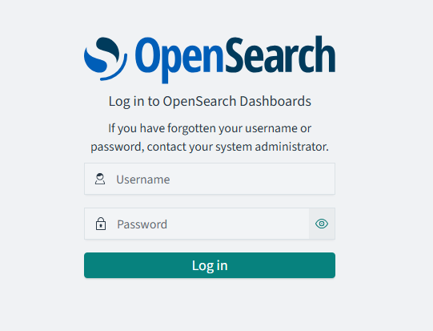

## Database
### MySQL
#### 1) pvc 생성
```bash
kubectl apply -f ~/egovframe-operating-environment-msa/k8s-deploy/manifests/egov-db/mysql-pv-nfs.yaml
```

#### 2) mysql 배포
```bash
kubectl apply -f ~/egovframe-operating-environment-msa/k8s-deploy/manifests/egov-db/mysql.yaml
```

#### 3) DB 데이터 초기화
- 기존 공통컴포넌트 Script: `k8s-deploy/scripts/dbscripts/`
    - com_DDL_mysql.sql
    - com_DML_mysql.sql
    - com_Comment_mysql.sql

- MSA 전용 Script: `EgovAuthor/script`
    - dml/mysql/com_DDL_mysql.sql
    - ddl/mysql/com_DML_mysql.sql
    - comment/mysql/egov_mysql_comment.sql

#### 4) OpenSearch 
- nfs pv 생성
```bash
kubectl apply -f ~/egovframe-operating-environment-msa/k8s-deploy/manifests/egov-db/opensearch-pv-nfs.yaml
```
- OpenSearch용 db 배포
```bash
kubectl apply -f ~/egovframe-operating-environment-msa/k8s-deploy/manifests/egov-db/opensearch.yaml
```
- OpenSearch Dashboards 배포
```bash
kubectl apply -f ~/egovframe-operating-environment-msa/k8s-deploy/manifests/egov-db/opensearch-dashboard.yaml
```

#### 5) 실행확인
- mysql
    - egovdb 접속 : `kubectl exec -it mysql-0 -n egov-db -- bash`
    - mysql 접속 : `mysql -u 유저명 -p비밀번호`
    - 추가한 데이터베이스가 있는지 확인
        - DB명 : com
        ```sql
        mysql> SHOW DATABASES;
        +--------------------+
        | Database           |
        +--------------------+
        | com                |
        | information_schema |
        | performance_schema |
        +--------------------+
        ```
    - DB 접속 : `USE com;`
    - 테이블 확인
        ```sql
        mysql> SHOW TABLES;
        +------------------------+
        | Tables_in_com          |
        +------------------------+
        | comtccmmnclcode        |
        | comtccmmncode          |
        | comtccmmndetailcode    |
        | comtecopseq            |
        | comtnauthorgroupinfo   |
        | comtnauthorinfo        |
        | comtnauthorrolerelate  |
        | comtnbbs               |
        | comtnbbsmaster         |
        | comtnbbsmasteroptn     |
        | comtnbbssynclog        |
        | comtnblog              |
        | comtnbloguser          |
        | comtncmmnty            |
        | comtncmmntyuser        |
        | comtncomment           |
        | comtnemplyrinfo        |
        | comtnemplyrscrtyestbs  |
        | comtnentrprsmber       |
        | comtnfile              |
        | comtnfiledetail        |
        | comtngnrlmber          |
        | comtnloginpolicy       |
        | comtnmenucreatdtls     |
        | comtnmenuinfo          |
        | comtnorgnztinfo        |
        | comtnprogrmlist        |
        | comtnqestnrinfo        |
        | comtnqustnrqesitm      |
        | comtnqustnrrespondinfo |
        | comtnqustnrtmplat      |
        | comtnroleinfo          |
        | comtnsitemap           |
        | comtnstsfdg            |
        | comtntmplatinfo        |
        | comvnusermaster        |
        | msatnauthorgroupinfo   |
        | msatnauthorinfo        |
        | msatnauthorrolerelate  |
        | msatnemplyrscrtyestbs  |
        | msatnmenucreatdtls     |
        | msatnroleinfo          |
        | msatnroles_hierarchy   |
        +------------------------+
        ```

- OpenSearch-Dashboard   
    
    - `http://서버IP:30561` 접속
    - 기본 로그인 정보 : admin/admin
    - ⚠️ 주의: 기본 설정 비번은 반드시 변경한 후 사용한다.

 ---
 <div align="center">
    <table>
      <tr>
         <th><a href="monitoring.md">◁ Step4. 모니터링 도구 배포</a></th>
         <th>Step5. DB 구성 및 배포</th>
         <th><a href="infra.md">Step6. Infra 구성 및 배포 ▷</a></th>
      </tr>
    </table>
 </div>
