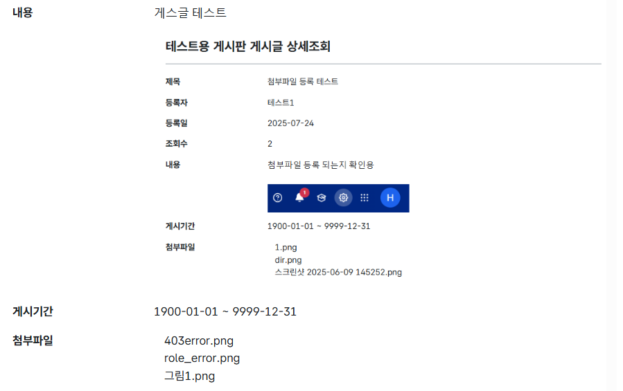
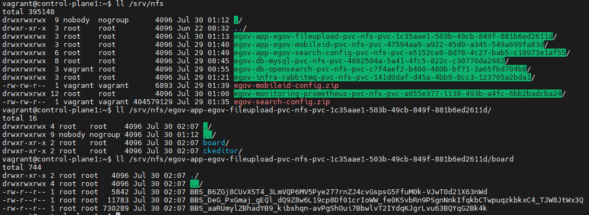

## 서비스 테스트 (Test)

### 1. 게시판 파일 업로드
> 게시판에서 Ckeditor에 이미지를 첨부하거나 첨부파일을 등록하는 경우 nfs 공유 폴더에 물리적인 파일 생성
- 서비스 내에서 첨부파일 이미지를 삭제하거나 pv가 삭제되어도 nfs의 파일은 삭제되지 않음

#### 1) 게시판에 Ckeditor 이미지 첨부 및 첨부파일 첨부

#### 2) nfs 폴더 접속

- egov-app-egov-fileupload-pvc-nfs-xxx... 폴더 내부에 ckeditor,board 폴더 생성
- ckeditor에 올린 이미지 1개와 board에 올린 이미지 3개 확인 가능
