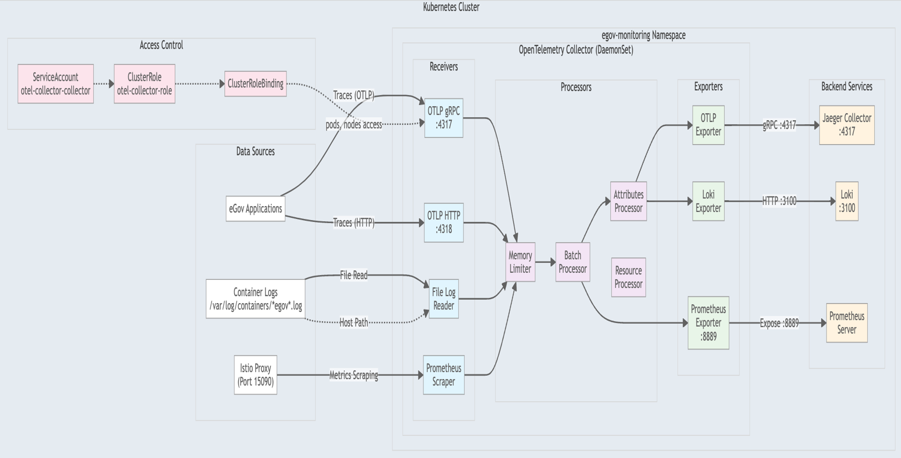
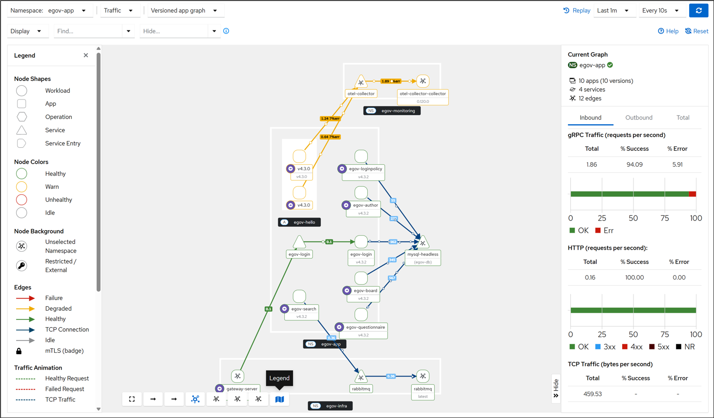
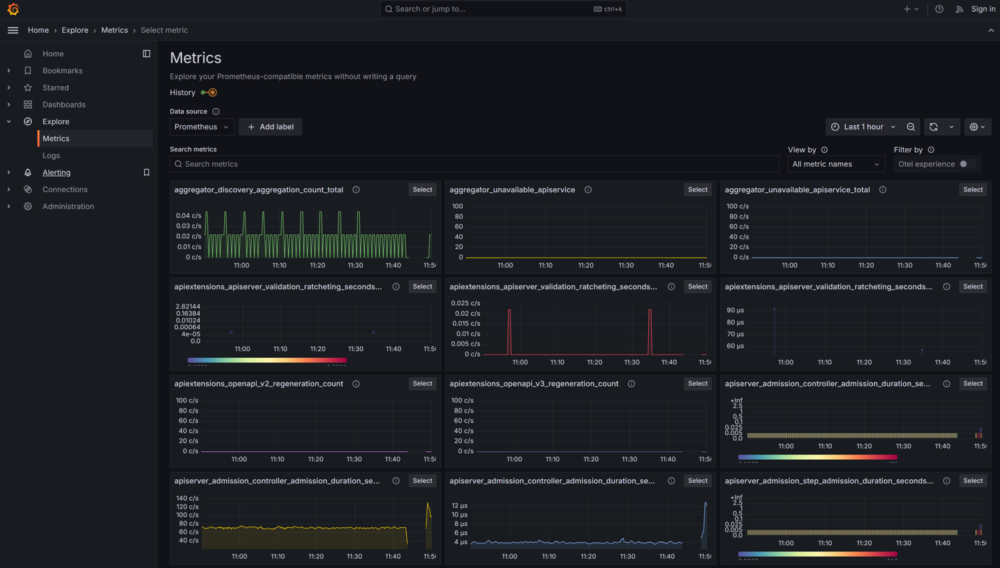
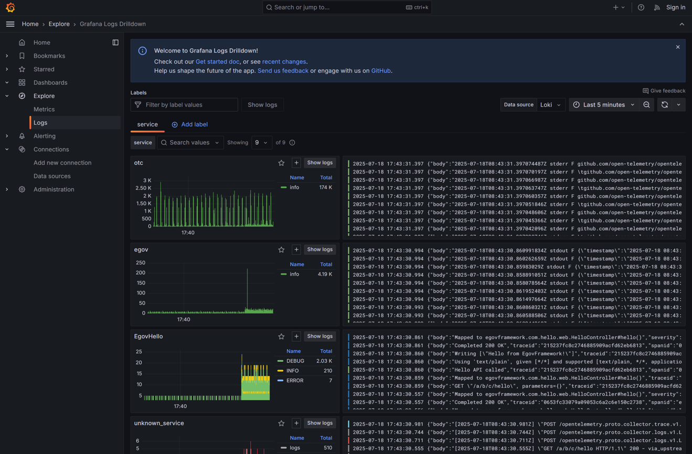
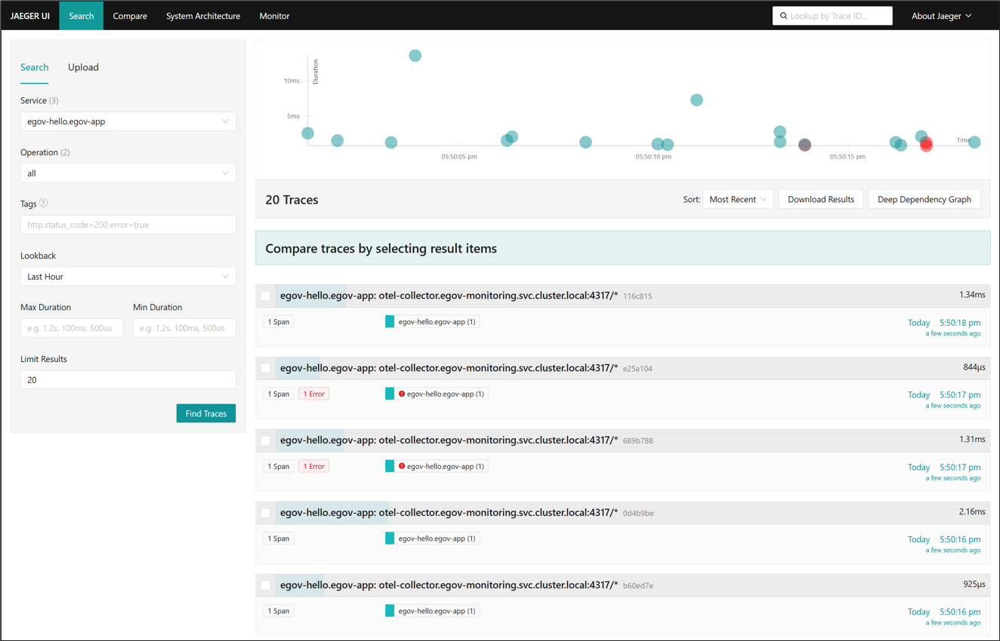

# OpenTelemetry 모니터링 UI

## 개요

OpenTelemetry를 통해 수집된 텔레메트리 데이터(메트릭, 로그, 추적)를 시각화하고 분석하기 위한 모니터링 도구들을 제공합니다. 각 도구는 관찰 가능성(Observability)의 3요소를 통해 시스템의 상태를 실시간으로 파악할 수 있도록 지원한다.

## 모니터링 도구 접속 정보

| 도구 | 포트 | 접속 주소 | 설명 |
|------|------|----------|------|
| **Kiali** | 30001 | `http://<node-ip>:30001` | Service Mesh 시각화 및 트래픽 분석 |
| **Grafana** | 30002 | `http://<node-ip>:30002` | 메트릭 및 로그 대시보드 (메트릭: Prometheus, 로그: Loki) |
| **Jaeger** | 30003 | `http://<node-ip>:30003` | 분산 추적 데이터 시각화 |
| **Prometheus** | 30004 | `http://<node-ip>:30004` | 메트릭 데이터 수집 및 저장 |
| **AlertManager** | 30004 | `http://<node-ip>:30004` | 알림 관리 |

> **기본 로그인 정보**  
> - Grafana: admin / admin (초기 접속 시 비밀번호 변경 필요)  
> - Kiali: anonymous 전략 사용 시 로그인 불필요  
> - Jaeger: 로그인 불필요  

## OpenTelemetry Collector 구성

OpenTelemetry Collector는 텔레메트리 데이터의 수집, 처리, 변환, 내보내기를 담당하는 중앙 허브 역할을 수행한다.



### 주요 기능

#### 1. Receivers (수신기)
- **OTLP**: OpenTelemetry 프로토콜을 통한 텔레메트리 데이터 수신
  - gRPC 엔드포인트: `0.0.0.0:4317`
  - HTTP 엔드포인트: `0.0.0.0:4318`
- **Filelog**: 컨테이너 로그 파일 수신 (`/var/log/containers/*`)
- **Prometheus**: Prometheus 형식의 메트릭 데이터 수신

#### 2. Processors (처리기)
- **Memory Limiter**: 메모리 사용량 제한 (80% 제한, 25% 스파이크 제한)
- **Batch**: 배치 처리를 통한 효율적인 데이터 전송
- **Attributes**: 메타데이터 추가 및 속성 변환

#### 3. Exporters (내보내기)
- **Jaeger**: 분산 추적 데이터를 Jaeger로 전송
- **Tempo**: 분산 추적 데이터를 Tempo로 전송 (백업)
- **Prometheus**: 메트릭 데이터를 Prometheus 형식으로 내보내기
- **Loki**: 로그 데이터를 Loki로 전송


## Kiali - Service Mesh 모니터링

Kiali는 Service Mesh 내의 서비스 간 트래픽과 통신 관계를 시각적으로 보여주는 대시보드이다.



### 주요 기능

#### 1. Traffic Graph (트래픽 그래프)
- 서비스 간 통신 관계 시각화
- 트래픽 흐름 및 지연 시간 표시
- 에러율 및 응답 코드 표시
- 실시간 트래픽 패턴 분석

#### 2. Workloads (워크로드)
- 각 서비스의 Pod 상태 모니터링
- 리소스 사용량 (CPU, 메모리)
- 헬스 체크 상태

#### 3. Services (서비스)
- 서비스 엔드포인트 정보
- 인바운드/아웃바운드 정책
- 가상 서비스 및 목적지 규칙

#### 4. Istio 설정 관리
- Virtual Service 관리
- Destination Rule 설정
- Gateway 및 ServiceEntry 구성

## Grafana - 통합 대시보드

Grafana는 메트릭과 로그 데이터를 통합하여 시각화하는 플랫폼이다.

### 1. Metrics 대시보드 (데이터소스: Prometheus)



#### 주요 메트릭
- **HTTP 요청 메트릭**
  - 요청 수 (Rate)
  - 응답 시간 (Latency)
  - 에러율 (Error Rate)
- **JVM 메트릭**
  - 힙 메모리 사용량
  - GC 시간
  - 스레드 수
- **시스템 메트릭**
  - CPU 사용률
  - 메모리 사용량
  - 디스크 I/O

### PromQL (Prometheus Query Language)
PromQL은 Prometheus의 메트릭 데이터를 쿼리하기 위한 함수형 쿼리 언어이다. 시간 시리즈 데이터를 선택, 집계, 변환하여 메트릭을 분석할 수 있다.

#### PromQL 쿼리 예시
```promql
# 초당 요청 수
rate(http_server_requests_seconds_count[5m])

# 95 백분위 응답 시간
histogram_quantile(0.95, rate(http_server_requests_seconds_bucket[5m]))

# JVM 힙 메모리 사용량
jvm_memory_used_bytes{area="heap"}
```

### 2. Logs 대시보드 (데이터소스: Loki)



#### 주요 기능
- 로그 집계 및 필터링
- 로그 레벨별 필터링 (INFO, WARN, ERROR)
- LogQL 쿼리를 통한 로그 검색
- 시간 범위 기반 로그 분석

### LogQL (Log Query Language)
LogQL은 Loki의 로그 데이터를 쿼리하기 위한 언어이다. PromQL의 영향을 받아 만들어진 언어로, 로그 스트림을 선택하고 필터링하여 로그를 검색하고 분석할 수 있다. PromQL과 유사한 문법을 사용하지만 로그 데이터에 최적화되어 있다.

#### LogQL 쿼리 예시
```logql
# 특정 서비스의 에러 로그
{namespace="egov-app"} |= "ERROR"

# 특정 사용자의 로그
{service_name="egov-login"} | json | user_id="12345"

# 지난 5분간의 오류
rate({level="ERROR"}[5m])
```

#### 구조화된 로그 활용
OpenTelemetry가 수집하는 JSON 형식의 구조화된 로그를 통해:
- 로그 메타데이터 기반 필터링
- Trace ID와 Span ID를 통한 로그-추적 연계
- 사용자 세션, 비즈니스 플로우 등 특정 컨텍스트와 관련된 로그 추적 및 분석

## Jaeger - 분산 추적

Jaeger는 마이크로서비스 간의 요청 추적 및 성능 분석을 제공하는 분산 추적 시스템이다.



### 주요 기능

#### 1. Trace 조회
- 서비스별 추적 조회
- 시간 범위별 추적 데이터 필터링
- 태그 기반 추적 검색
- Operation 이름별 필터링

#### 2. Trace 상세 분석
- 서비스 간 호출 계층 시각화
- Span별 소요 시간 분석
- 병목 구간 식별
- 에러 발생 Span 식별

#### 3. 성능 분석
- 서비스 종속성 그래프 (Service Dependency Graph)
- 서비스별 성능 통계 (Throughput, p50, p95, p99)
- Slow Request 분석

### Trace 구조

```
Trace (하나의 사용자 요청)
  ├── GatewayServer Span (150ms)
  │   ├── EgovAuthor Span (50ms)
  │   │   └── Database Query Span (30ms)
  │   └── EgovBoard Span (80ms)
  │       └── Database Query Span (60ms)
  └── EgovMain Span (120ms)
      └── EgovSearch Span (100ms)
```

## 모니터링 데이터 활용 시나리오

### 시나리오 1: 성능 저하 문제 해결
1. **Grafana 메트릭 대시보드**에서 응답 시간 지표 확인
2. **Jaeger**에서 해당 시간대의 Trace 확인
3. **Span 상세 분석**으로 병목 구간 식별
4. **Kiali 트래픽 그래프**로 서비스 간 통신 패턴 확인

### 시나리오 2: 에러 원인 분석
1. **Grafana Loki**에서 에러 로그 검색
2. 로그의 **Trace ID** 추출
3. **Jaeger**에서 해당 Trace 조회
4. **전체 호출 흐름** 확인으로 에러 발생 구간 파악

### 시나리오 3: 트래픽 패턴 분석
1. **Kiali 트래픽 그래프**로 서비스 간 통신 시각화
2. **Grafana Prometheus**로 각 서비스의 메트릭 확인
3. 트래픽 증감 패턴 분석
4. 리소스 사용량과의 연관성 확인


## 참고 자료

- [OpenTelemetry 구성 가이드](../opentelemetry_config_guide.md)
- [OpenTelemetry 소개](../intro/opentelemetry.md)
- [Kubernetes 배포 가이드](../kubernetes/guide.md)
