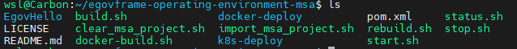

# 프로젝트 준비

## 1. 기본 프로젝트 준비
### 1. 깃허브에서 Clone
1.  [깃허브 레포지토리](https://github.com/eGovFramework/egovframe-operating-environment-msa) 접속
2. 레포지토리 clone
    ```bash
    git clone https://github.com/eGovFramework/egovframe-operating-environment-msa
    ```


### 2. 실행권한 부여
1. 프로젝트 디렉토리로 이동
    ```bash
    cd egovframe-operating-environment-msa
    ```

2. 실행권한 부여
    ```bash
    chmod +x *.sh
    chmod +x docker-deploy
    chmod +x k8s-deploy/scripts/**/*.sh
    ```

## 2. 내부 디렉토리 구조 확인

```text
docker-deploy                 ## 도커 배포 관련 폴더
EgovHello                     ## Kubernetes-Istio용 프로젝트 
k8s-deploy                    ## 쿠버네티스 관련 폴더
build.sh                      ## 프로젝트 자동 build 쉘
clear_msa_project.sh          ## import한 msa 프로젝트 삭제
docker-build.sh               ## docker image build를 위한 쉘
import_msa_project.sh         ## MSA_KRDS_CommonComponent 파일을 자동 import 시켜주는 쉘
LICENSE                       ## 라이센스
pom.xml                       ## 프로젝트 모듈
README.md
rebuild.sh                    ## 빌드를 다시하는 쉘
start.sh                      ## 로컬로 서비스 실행
status.sh                     ## 현재 서비스 실행 상태 확인
stop.sh                       ## 로컬 서비스 정지
```

## 3. 서비스 프로젝트 Import

### 1. import_msa_project.sh 실행
```bash
./import_msa_project.sh
```
```import_msa_project.sh```
- git repository url과 가져올 브랜치/태그 설정
    ```sh
    REPO_URL="https://github.com/eGovFramework/egovframe-common-components-msa-krds"
    TAG="v4.3.2"
    TMP_DIR="./common-components-msa-temp"
    echo "Import Project - egovframe-common-components-msa $TAG"
    ```
    - REPO_URL = Import할 github Repository
    - TAG : 레포지토리의 릴리즈 버전(현재 최신 릴리즈)
    - TMP_DIR : 임시 디렉토리가 생성될 폴더 경로 

- 지정한 레포지토리에서 복사할 디렉토리 선정
    ```sh
    DIRS=(
        ConfigServer
        EgovAuthor
        EgovBoard
        EgovCmmnCode
        EgovLogin
        EgovLoginPolicy
        EgovMain
        EgovMobileId
        EgovQuestionnaire
        EgovSearch-Config
        EgovSearch
        EurekaServer
        GatewayServer
    )
    ```

- 임시 디렉토리(TMP_DIR)로 소스 다운로드 및 압축 해제
    ```sh
        echo "[INFO] Downloading source from GitHub..."
        mkdir -p "$TMP_DIR"
        curl -L "$REPO_URL/archive/refs/tags/$TAG.zip" -o "$TMP_DIR/source.zip"

        echo "[INFO] Extracting..."
        unzip -q "$TMP_DIR/source.zip" -d "$TMP_DIR"

        EXTRACTED_DIR="$TMP_DIR/egovframe-common-components-msa-krds-${TAG#v}"
    ```

- 현재 디렉토리로 소스 복사
    ```sh
        for dir in "${DIRS[@]}"; do
        echo "[INFO] Copying $dir..."
        cp -r "$EXTRACTED_DIR/$dir" .
        
            # 특정 디렉토리는 Dockerfile 복사 생략
        if [ "$dir" == "EgovSearch-Config" ]; then
            echo "[SKIP] Skipping Dockerfile copy for $dir"
            continue
        fi
        
        cp ./docker-deploy/"$dir"/Dockerfile* "./$dir"
        done
    ```

- 다운로드에 사용한 임시 파일 제거
    ```sh
        echo "[INFO] Cleaning up..."
        rm -rf "$TMP_DIR"

        echo "[DONE] All selected components have been copied."
    ```

### 2. Import 후 내부 디렉토리 구조   

- 추가된 프로젝트
    - ConfigServer
    - EgovAuthor
    - EgovBoard
    - EgovCmmnCode
    - EgovLogin
    - EgovMain
    - EgovMobileId
    - EgovQuestionnarie
    - EgovSearch
    - EgovSearch-Config
    - EurekaServer
    - GatewayServer

### 프로젝트가 제대로 빌드되지 않은 경우
- ```clear_msa_project.sh``` 를 통해 초기화 후 다시 import
---

<div align="center">
   <table>
     <tr>
        <th><a href="step1.md">◁ Step1. 환경설정</a></th>
       <th>Step2. 프로젝트 준비</th>
       <th><a href="step3.md">Step3. 프로젝트 빌드 ▷</a></th>
     </tr>
   </table>
</div>

<!-- <div style="display:flex; justify-content:space-between">
<a href="/step1.md">◁ Step1. 환경설정</a>
<a href="/Readme.md">HOME</a>
<a href="/step3.md">Step3. 프로젝트 빌드 ▷</a>
</div> -->

<!-- |  [◁ Step1. 환경설정](/step1.md) | [HOME](/README.md) | [Step3. 프로젝트 빌드 ▷](/step3.md) |
|----------------|--------------------|-------------------------------------| -->