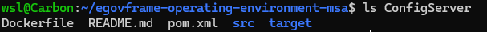

# 프로젝트 빌드

## 마이크로 서비스 프로젝트 목록
- ConfigServer
- EgovAuthor
- EgovBoard
- EgovCmmnCode
- EgovLogin
- EgovMain
- EgovMobileId
- EgovQuestionnarie
- EgovSearch
- EgovSearch-Config
- EurekaServer
- GatewayServer

## 서비스 빌드
### 1. 영구 저장소로 사용할 데이터 디렉토리 생성
- ```start.sh``` 를 통해 서비스를 실행하는 경우 사용할 서비스 등록 (mysql, opensearch, rabbitmq)
- 데이터 디렉토리 생성   
    ```bash
    mkdir -p k8s-deploy/data/{mysql,opensearch,rabbitmq}
    ```
- 권한 설정   
    ```bash
    chmod -R 777 k8s-deploy/data
    ```

### 2. 빌드 자동화 쉘 실행
```bash
./build.sh
```
```build.sh```
- ConfigServer 검증
    ```sh
    validate_config_server() {
        local config_file="ConfigServer/src/main/resources/application.yml"
        local default_path="file:/replace-with-your-config-path"
        
        if grep -q "$default_path" "$config_file"; then
            echo "Error: ConfigServer의 application.yml에서 search-locations가 기본값으로 설정되어 있습니다."
            echo "다음 경로를 실제 설정 저장소 경로로 변경해주세요:"
            echo "$default_path"
            echo "파일 경로: $config_file"
            return 1
        fi
        return 0
    }
    ```
    - config-file : ConfigServer에 대한 설정파일이 있는 경로
    - default_path : cloud를 통한 연결 시 실제 config 위치   
        ```ConfigServer/src/main/resources/application.yml``` 수정
    
- EgovSearch password 검증
    ```sh
    validate_egovsearch_password() {
        local config_file="EgovSearch/src/main/resources/application.yml"
        local default_password="yourStrongPassword123!"
        
        if grep -q "password: $default_password" "$config_file"; then
            echo "Error: EgovSearch의 application.yml에서 OpenSearch 패스워드가 기본값으로 설정되어 있습니다."
            echo "다음 패스워드를 실제 사용할 패스워드로 변경해주세요:"
            echo "$default_password"
            echo "파일 경로: $config_file"
            return 1
        fi
        return 0
    }
    ```
    - [EgovSearch Readme](readme.md) 참고하여 OpenSearch 구성 후 config_file에 지정된 경로에서 password 변경
    - OpenSearch 구성 시 기본 password는 'admin'


- 서비스 배열 정의
    ```sh
    services=(
        "ConfigServer"
        "EgovAuthor"
        "EgovBoard"
        "EgovCmmnCode"
        "EgovHello"
        "EgovLogin"
        "EgovMain"
        "EgovMobileId"
        "EgovQuestionnaire"
        "EgovSearch"
        "EurekaServer"
        "GatewayServer"
    )
    ```
    - [시작하기](step2.md)의 import_msa_project.sh를 통해 import한 프로젝트들을 서비스로 정의

- 빌드 함수
    ```sh
    build_service() {
        local service=$1
        
        # ConfigServer 빌드 전 설정 검증
        if [ "$service" == "ConfigServer" ]; then
            if ! validate_config_server; then
                exit 1
            fi
        fi

        # EgovSearch 빌드 전 설정 검증
        if [ "$service" == "EgovSearch" ]; then
            if ! validate_egovsearch_password; then
                exit 1
            fi
        fi
        
        echo "Building $service..."
        cd $service && mvn clean package && cd ..
    }

    # 인자가 있는 경우 해당 서비스만 빌드
    if [ $# -eq 1 ]; then
        # 서비스 이름이 유효한지 확인
        valid_service=false
        for service in "${services[@]}"; do
            if [ "$1" == "$service" ]; then
                valid_service=true
                break
            fi
        done

        if [ "$valid_service" = true ]; then
            build_service "$1"
        else
            echo "Error: Invalid service name '$1'"
            echo "Available services:"
            printf '%s\n' "${services[@]}"
            exit 1
        fi
    else
        # 인자가 없는 경우 모든 서비스 빌드
        for service in "${services[@]}"; do
            build_service "$service"
        done
        echo "All services have been built"
    fi
    ```
    - 인자가 있는 경우
        - ex) ```./build.sh EgovLogin```
        - 뒤에 작성한 인자에 대해서만 build 진행

    - 인자가 없는 경우
        - ex) ```./build.sh```
        - 서비스 배열에 작성한 서비스 전부 build 진행

### 3. 빌드 후 내부 디렉토리
- 각 서비스별 내부에 target 폴더 생성 확인   
    

---

<div align="center">
   <table>
     <tr>
        <th><a href="step2.md">◁ Step2. 프로젝트 준비</a></th>
       <th>Step3. 프로젝트 빌드</th>
       <th><a href="step4.md">Step4. 도커 이미지 빌드 ▷</a></th>
     </tr>
   </table>
</div>