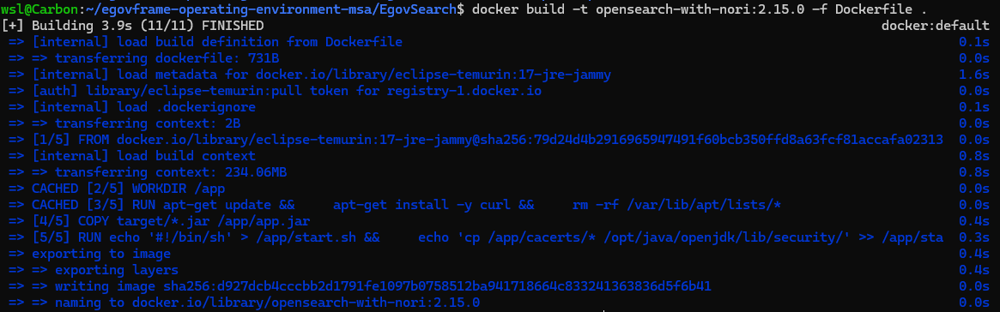
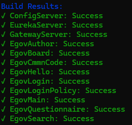
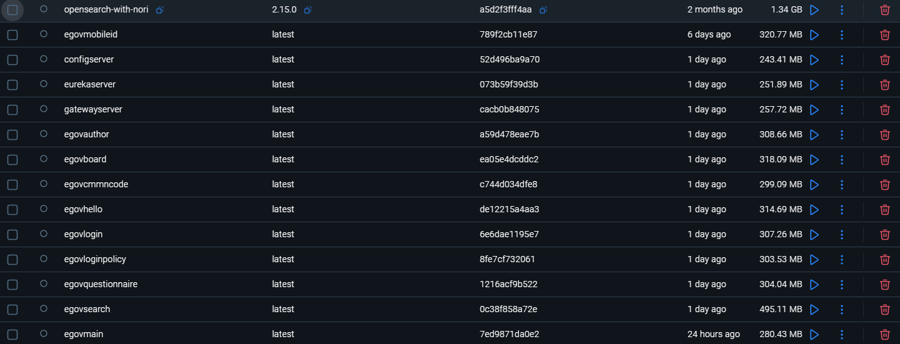

# 도커 이미지 빌드 (Docker Image Build)

## 1. OpenSearch 이미지 빌드
OpenSearch 한글 형태소 분석기(Opensearch-with-nori) 설치
- ```EgovSearch/Dockerfile.opensearch-with-nori```
    ```yml
    FROM opensearchproject/opensearch:2.15.0

    RUN /usr/share/opensearch/bin/opensearch-plugin install --batch analysis-nori
    ```
- OpenSearch 에서 한글 사용을 위해 OpenSearch 공식 이미지에 한글 형태소 분석기(nori) 플러그인을 설치
- ```--batch```  : 사용자 입력을 요구하지 않고 자동으로 진행하는 명령어

## 2. EgovSearch 도커 이미지 빌드
- docker-build 실행
    ```shell
    cd EgovSearch
    docker build -t opensearch-with-nori:2.15.0 -f Dockerfile.opensearch-with-nori .
    ```   
    - build 결과   
        
    - docker-desktop상 image가 추가되었는지 확인
        


## 3. 서비스 이미지 빌드
- 단일 도커 이미지 빌드 
    ```bash
    ./docker-build.sh <빌드할 프로젝트명>
    ```

- 전체 도커 이미지 빌드   
    ```bash
    ./docker-build.sh
    ```
    ```docker-build.sh```
    - 빌드할 서비스 이미지 배열 등록
        ```bash
        services=(
            "ConfigServer"
            "EurekaServer"
            "GatewayServer"
            "EgovAuthor"
            "EgovBoard"
            "EgovCmmnCode"
            "EgovHello"
            "EgovLogin"
            "EgovLoginPolicy"
            "EgovMain"
            "EgovMobileId"
            "EgovQuestionnaire"
            "EgovSearch"
        )
        ```
        - 아래의 서비스는 필요한 경우에 등록 
            - EgovHello : 샘플 서비스
            - EgovMobileId : 모바일신분증 관련 설정 필요
            - EgovSearch : EgovSearch 서버 구성 및 설정 필요   
            *EgovMobileId 와 EgovSearch의 경우 각 프로젝트 내 Readme를 참고해 설정 구성을 진행할 수 있음

    - 디렉토리 존재 확인
        ```bash
        if [ ! -d "$service" ]; then
            echo -e "${RED}Error: Directory $service not found${NC}"
            echo "${service}:Failed: Directory not found" >> $RESULT_FILE
            return 1
        fi
        ```
        - 서비스 디렉토리가 실제로 import 되어있는지 확인
        - 서비스 Import가 제대로 되지 않은 경우 [Step2. 프로젝트 준비](/step2.md) 참고

    - JAR 파일 존재 확인 (build 성공 여부)
        ```bash
        if [ ! -f "$service/target/"*.jar ]; then
            echo -e "${RED}Error: JAR file not found in $service/target/${NC}"
            echo "${service}:Failed: JAR file not found" >> $RESULT_FILE
            return 1
        fi
        ```
        - 각 프로젝트 서비스에 target 폴더가 생성되었는지 확인한다.
        - 프로젝트 빌드를 진행하지 않은 경우 [Step3. 프로젝트 빌드](/step3.md) 참고

    - 도커 이미지 빌드
        ```bash
        cd $service

        echo -e "${YELLOW}Building Docker image for $service...${NC}"
        image_name=$(echo $service | tr '[:upper:]' '[:lower:]')

        tag=$IMAGE_TAG
        dockerfile="Dockerfile"

        if ! docker build -f $dockerfile -t $image_name:$tag .; then
            echo -e "${RED}Docker build failed for $service${NC}"
            cd ..
            echo "${service}:Failed: Docker build failed" >> $RESULT_FILE
            return 1
        fi

        cd ..
        echo "${service}:Success" >> $RESULT_FILE
        echo -e "${GREEN}Successfully built $service${NC}"
        return 0
        ```
        - 각 서비스 폴더 내 Dockerfile을 통해 이미지 빌드
            - Ex) ```ConfigServer/Dockerfile```
                ```docker
                FROM openjdk:8-jre-slim
                WORKDIR /app

                RUN apt-get update && \
                    apt-get install -y curl && \
                    rm -rf /var/lib/apt/lists/*

                COPY target/*.jar /app/app.jar

                ENV SERVER_PORT=8888 \
                    SPRING_APPLICATION_NAME=ConfigServer \
                    SPRING_PROFILES_ACTIVE=native,default \
                    SPRING_CLOUD_CONFIG_SERVER_NATIVE_SEARCH_LOCATIONS=file:/config-repo \
                    SPRING_RABBITMQ_HOST=bbs_rabbitmq \
                    SPRING_RABBITMQ_PORT=5672 \
                    SPRING_RABBITMQ_USERNAME=guest \
                    SPRING_RABBITMQ_PASSWORD=guest \
                    MANAGEMENT_ENDPOINTS_WEB_EXPOSURE_INCLUDE="*" \
                    MANAGEMENT_ENDPOINT_HEALTH_SHOW-DETAILS=always

                HEALTHCHECK --interval=30s --timeout=3s \
                CMD curl -f http://localhost:8888/actuator/health || exit 1

                EXPOSE 8888

                ENTRYPOINT ["java", "-Djava.security.egd=file:/dev/./urandom", "-jar", "/app/app.jar"]
                ```
    - 이미지 빌드 결과 확인
        - 빌드 후 출력되는 결과
               
            - 명령어를 통해서도 확인 가능   
                ```docker images | grep latest```

        - docker-desktop   
            

---

<div align="center">
   <table>
     <tr>
        <th><a href="step3.md">◁ Step3. 프로젝트 빌드</a></th>
       <th>Step4. 도커 이미지 빌드</th>
       <th><a href="step5.md">Step5.서비스 실행 ▷</a></th>
     </tr>
   </table>
</div>