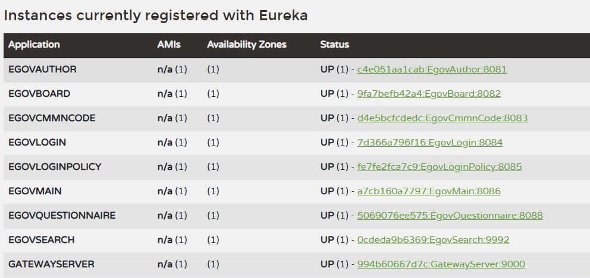
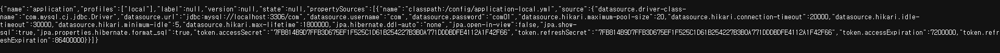
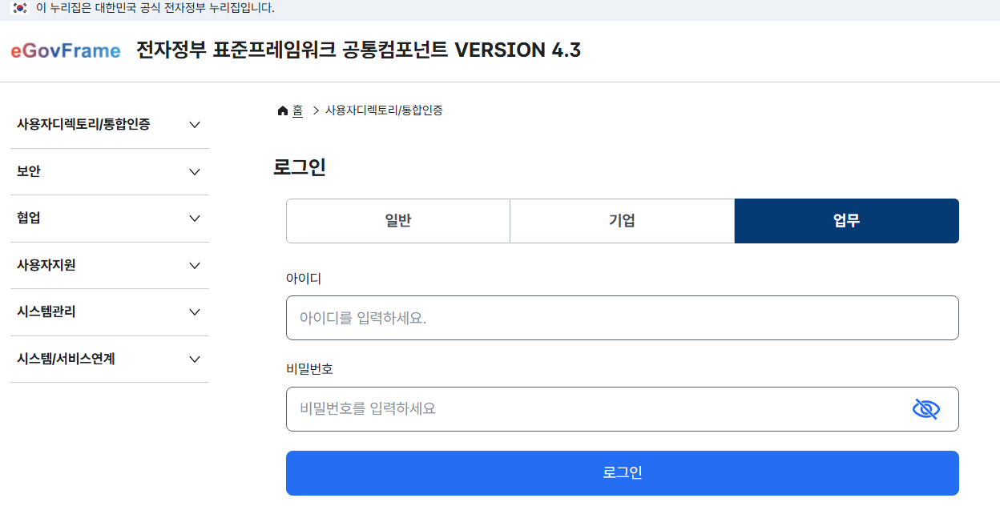
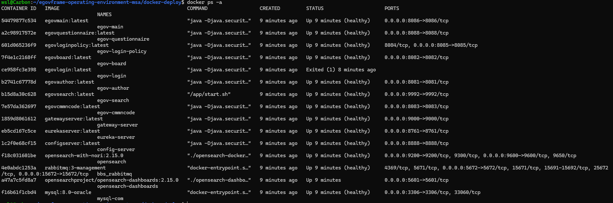

# 서비스 실행

## 1. ConfigServer-config 설정 확인
- ```docker-deploy/docker-compose.yml```
    ```yaml
    config-server:
        image: configserver:${IMAGE_TAG}
        container_name: config-server
        ports:
        - "${CONFIG_SERVER_PORT}:${CONFIG_SERVER_PORT}"
        environment:
        - SPRING_PROFILES_ACTIVE=${CONFIG_SERVER_PROFILE}
        - SPRING_CLOUD_CONFIG_SERVER_NATIVE_SEARCH_LOCATIONS=file:${CONFIG_REPO_PATH}
        - SPRING_RABBITMQ_HOST=bbs_rabbitmq
        - SPRING_RABBITMQ_PORT=${RABBITMQ_PORT}
        - SPRING_RABBITMQ_USERNAME=${RABBITMQ_USER}
        - SPRING_RABBITMQ_PASSWORD=${RABBITMQ_PASSWORD}
        volumes:
        - ${CONFIG_LOCAL_PATH}:${CONFIG_REPO_PATH}:ro
    ```
    - .env 파일 참조
        - 실제 ConfigServer에 대한 설정이 존재하는 경로 :  ```CONFIG_LOCAL_PATH=../ConfigServer-config```
        - 볼륨 마운트 되는 경로 :  ```CONFIG_REPO_PATH=/config-repo```
    - ConfigServer에 대한 docker 설정은 실제 ConfigServer-config 디렉토리에 존재하고 config-repo의 경로로 볼륨 마운트 되는 상태
    - docker가 파일을 읽어들이는 순서
        1. docker-compose.yml의 Environment
        2. 각 서비스(로컬)의 application.yml
        3. ConfigServer의 application.yml
        > 세 파일에 동일한 설정이 존재할 시 제일 마지막에 읽어들이는 설정으로 적용
- 현재 ConfigServer/src/main
- SPRING_ACTIVE_PROFILE
    ```yaml
    gateway-server:
        image: gatewayserver:${IMAGE_TAG}
        container_name: gateway-server
        ports:
        - "${GATEWAY_SERVER_PORT}:${GATEWAY_SERVER_PORT}"
        environment:
        - SPRING_PROFILES_ACTIVE=${SPRING_PROFILES_ACTIVE_DEFAULT}
        - SPRING_CONFIG_IMPORT=optional:configserver:http://config-server:${CONFIG_SERVER_PORT}
    ```
    - .env파일에서 SPRING_PROFILES_ACTIVE_DEFAULT=docker 로 지정하고 있으므로 docker는 실행 시 applicaiton-'docker'가 포함된 파일을 찾아 읽음
    - ex) EurekaServer를 localhost와 docker를 이용하는 방법
        - localhost (application-local) - 
            ```defaultZone: http://localhost:8761/eureka/```
        - docker (application--docker) -
            ```defaultZone: http://eureka-server:8761/eureka/```
    
## 2. ConfigServer-config/application-docker.yml 생성
- ConfigServer의 설정 파일 경로는 Environment(.env)에 작성되어있으므로 설정파일을 다른 디렉토리에 생성 시 해당 경로도 변경 필요함
```yaml
eureka:
  client:
    register-with-eureka: true # Eureka 등록 여부
    fetch-registry: true # Eureka 조회 여부
    registry-fetch-interval-seconds: 5 # 클라이어트 측에서 레지스트리를 캐싱하는 시간
    serviceUrl:
      defaultZone: http://eureka-server:8761/eureka/
    instance:
      lease-renewal-interval-in-seconds: 3  # 기본값 30초 → 3초로 변경 (더 자주 heartbeat 전송)
      lease-expiration-duration-in-seconds: 10  # 기본값 90초 → 10초로 변경 (서비스 제거 시간 단축)
      instance-id: ${spring.application.name}:${spring.application.instance_id:${random.value}} 
```
- EurekaServer가 docker container를 통해 실행될 수 있도록 설정값 지정

### 1) application.yml
- 서비스에서 공통적으로 사용할 설정 파일 작성
- DB, JPA 설정, token 값 등
```yaml
datasource:
  driver-class-name: com.mysql.cj.jdbc.Driver
  url: jdbc:mysql://localhost:3306/com
  username: com
  password: com01
  hikari:
    maximum-pool-size: 20 # 각 서비스의 최대 연결 수 제한
    connection-timeout: 20000 # 연결을 얻기 위한 최대 대기 시간 (밀리초)
    idle-timeout: 30000 # 유휴 상태에서 연결을 유지할 시간 (밀리초)
    minimum-idle: 5 # 유휴 상태로 유지할 연결 수
    max-lifetime: 1800000 # 연결의 최대 수명 (밀리초)

jpa:
  hibernate:
    ddl-auto: none
  open-in-view: false
  show-sql: true
  properties:
    hibernate:
      format_sql: true

token:
  accessSecret: "7FB814B9D7FFB3D675EF1F525C1D61B254227B3B0A771DDDBDFE4112A1F42F66" # sha256(egovframework)
  refreshSecret: "7FB814B9D7FFB3D675EF1F525C1D61B254227B3B0A771DDDBDFE4112A1F42F66" # sha256(egovframework)
  accessExpiration: 7200000 # TTL (millisecond, 2 Hour)
  refreshExpiration: 86400000 # TTL (millisecond, 1 Day)
```

### 2) application-docker.yml
- 각 서비스를 docker 컨테이너에서 실행시키는 설정파일
- 기본값으로 각 서비스 application.yml에서 eureka-server는 localhost로 연결되어있음.
- 각 프로젝트별로 application.yml 파일이 존재하므로 docker 실행 시 오버라이딩이 필요한 부분만 작성
    ```yaml
    datasource:
        url: jdbc:mysql://mysql-com:3306/com
    eureka:
        client:
            serviceUrl:
                defaultZone: http://eureka-server:8761/eureka/ 
    ```
- docker-compose up을 통해 실행하면 서비스가 docker 컨테이너에서 실행되므로 localhost가 아닌 컨테이너 이름으로 연결되어야함

### 3) EgovMain의 EurekaServer 설정 변경
- EgovMain은 spring-cloud-config를 사용하지 않아 ConfigServer의 설정을 가져오지 않음.
- ```EgovMain/src/main/resources/application.yml```
    ```yaml
    serviceUrl:
      defaultZone: http://eureka-server:8761/eureka/
    ```
    - localhost가 아닌 docker 컨테이너의 eureka서버로 연결될 수 있도록 변경
- 수정 후 build 진행
    - `./build.sh EgovMain`
    - `./docker-build.sh EgovMain`

## 3. 서비스 실행
1. docker 명령어
    ```bash
    cd docker-deploy
    docker compose --env-file .env -f docker-compose.yml up -d
    ```

2. make 명령어
    1) make 명령어 다운로드 : ```sudo apt install make```
    2) 수동 다운로드 : [makeGNU](https://gnuwin32.sourceforge.net/packages/make.htm)   
        *Window의 경우 환경변수에 Path 등록
    3) 실행 : ```make start```

## 4. 실행결과 확인
- **EurekaServer (localhost:8761)**   
   
- **ConfigServer (localhost:8888)**   

    - token 값이 출력되는지 확인 필요
    - token값이 출력되지 않거나 accessToken 관련 null 에러가 생기는 경우 ConfigServer와 연결이 제대로 이루어지지 않았을 수 있음   


- **GatewayServer (localhost:9000)**   

    - 로그인 테스트
        |구분 | 아이디 | 비밀번호 |
        |---|---|---|
        |일반사용자|USER|rhdxhd12|
        |기업사용자|ENTERPRISE|rhdxhd12|
        |업무사용자|TEST1|rhdxhd12|
    - 로그인이 되지 않는 경우 DB에 테이블과 데이터 구성이 되어있는지 확인
- **docker 명령어를 이용해 확인**   
    - ```docker ps -a```   
        
        - 해당 명령어는 컨테이너에서 실행된 서비스를 보여주는 기능으로 에러 발생 시 실제 오류 로그 확인 필요
        - ```docker logs <Container ID>```
        - 또는 docker-desktop에서 문제가 있는 container 로그 확인
---

<div align="center">
   <table>
     <tr>
        <th><a href="step4.md">◁ Step4. 도커 이미지 빌드</a></th>
        <th>Step5. 서비스 실행</th>
     </tr>
   </table>
</div>