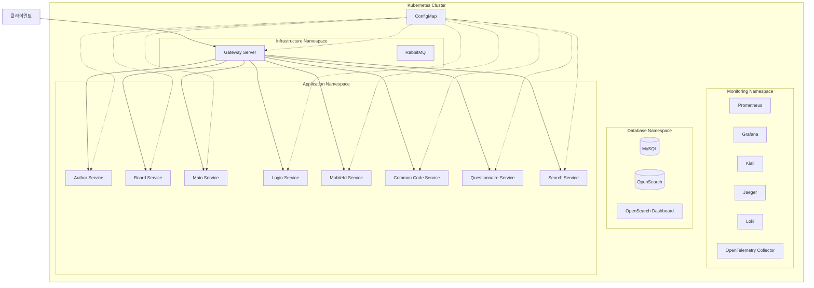

# 공통컴포넌트 MSA 쿠버네티스 배포 가이드

## 1. 개요

### 시스템 요구사항

#### 하드웨어 요구사항

- CPU: 8코어 이상 권장
- RAM: 최소 32GB 이상 권장 (Kubernetes 클러스터 및 모니터링 스택 운영)
- 디스크: 최소 100GB 이상의 여유 공간

#### 소프트웨어 요구사항

- **운영체제**
    - macOS (macOS Sequoia 15.3.2 에서 테스트)
- **필수 소프트웨어**
    - Docker Desktop for Mac 4.39.0(184744)
      Docker Engine 28.0.1
    - Kubernetes v1.32.2
    - kubectl v1.31.4
    - Git 2.3.5 (Apple Git-154)
    - Istio 1.25.0
    - cert-manager 1.13.2
    - OpenTelemetry Operator 0.120.0
- **네트워크**
    - 인터넷 연결 (컨테이너 이미지 다운로드용)
    - NodePort 서비스를 위한 30000-32767 포트 범위
    - Istio Ingress Gateway를 위한 로드밸런서 구성
- **이미지 목록**
    - openjdk:8-jre-slim
      EgovAuthor, EgovBoard, EgovCmmnCode, EgovLogin, EgovMain, EgovMobileId, EgovQuestionnaire 에서 사용
      slim 버전으로 최소한의 패키지만 포함하며, 프로덕션 환경에서 권장된다.
    - eclipse-temurin:17-jre-jammy
      EgovSearch 에서 사용하여 디버깅 목적으로 사용하였다.
    - mysql:8.0-oracle
    - opensearchproject/opensearch:2.15.0
    - opensearchproject/opensearch-dashboards:2.15.0
    - rabbitmq:3-management
    - ootel/opentelemetry-collector-contrib:0.120.0
    - grafana/loki:2.9.2
    - jaegertracing/all-in-one:1.63.0
    - prom/prometheus:v2.45.0
    - grafana/grafana:11.3.1

### 아키텍처 구성도



### 쿠버네티스 리소스 구성

#### 1. 네임스페이스 구성

- istio-system: Istio 서비스 메시
- egov-istio: Istio 설정 (Telemetry)
- egov-infra: 인프라 서비스 (Config Server, RabbitMQ)
- egov-app: 애플리케이션 서비스 (egov-main, egov-board, egov-login, egov-author, egov-mobileid, egov-questionnaire, egov-cmmncode, egov-search)
- egov-db: 데이터베이스 (MySQL, OpenSearch)
- egov-monitoring: 모니터링 도구 (Prometheus, Grafana, Kiali, Jaeger, Loki, OpenTelemetry Collector)

#### 2. 주요 컴포넌트 구성

1. **서비스 메시 (Istio)**
    - Ingress Gateway
    - 서비스간 통신 보안
    - 트래픽 관리
    - 텔레메트리 수집 (metrics, traces, logs 등)
2. **모니터링 스택**
    - Prometheus: metrics 수집
    - Grafana: 대시보드
    - Kiali: 서비스 메시 시각화
    - Jaeger: 분산 추적 (traces)
    - Loki: logs 집계 및 분석
    - OpenTelemetry: 텔레메트리 수집 및 전달 (metrics, traces, logs 등)
3. **스토리지**
    - MySQL StatefulSet
    - OpenSearch StatefulSet
    - Persistent Volume Claims
4. **설정 관리**
    - ConfigMaps
    - Secrets
5. **애플리케이션 배포**
    - Deployments
    - Services
    - HorizontalPodAutoscalers

#### 3. 리소스 요구사항

```yml
resources:
  limits:
    cpu: "1"
    memory: "1Gi"
  requests:
    cpu: "500m"
    memory: "512Mi"
```

#### 4. 헬스체크 구성

```yml
livenessProbe:
  httpGet:
    path: /actuator/health
    port: 8080
  initialDelaySeconds: 60
  periodSeconds: 30

readinessProbe:
  httpGet:
    path: /actuator/health
    port: 8080
  initialDelaySeconds: 30
  periodSeconds: 10
```

#### 5. 스케일링 구성

```yml
apiVersion: autoscaling/v2
kind: HorizontalPodAutoscaler
metadata:
  name: egov-board
spec:
  scaleTargetRef:
    apiVersion: apps/v1
    kind: Deployment
    name: egov-board
  minReplicas: 2
  maxReplicas: 5
  metrics:
  - type: Resource
    resource:
      name: cpu
      target:
        type: Utilization
        averageUtilization: 80
```

## 2. 디렉토리 구조

```
k8s-deploy/
├── MSA-공통컴포넌트-쿠버네티스-배포-가이드.md  # 가이드 문서
├── MSA-공통컴포넌트-Istio-테스트-가이드.md  # Istio 테스트 가이드 문서
├── bin/                   # 실행 가능한 바이너리 및 도구 디렉토리
│   └── istio-1.25.0/       # Istio 설치 용도 디렉토리
├── data/                  # 영구 데이터 저장소 디렉토리
│   ├── mysql/              # MySQL 데이터 디렉토리
│   ├── opensearch/         # OpenSearch 데이터 디렉토리
│   │   └── nodes/          # OpenSearch 노드 데이터 디렉토리
│   ├── rabbitmq/         # RabbitMQ 데이터 디렉토리
│   ├── jenkins/         # Jenkins 데이터 디렉토리
│   ├── gitlab/         # GitLab 데이터 디렉토리
│   ├── sonarqube/         # SonarQube 데이터 디렉토리
│   └── nexus/         # Nexus 데이터 디렉토리
├── manifests/             # Kubernetes 리소스 매니페스트 디렉토리
│   ├── egov-common/           # 공통 환경 변수 설정 매니페스트
│   │   ├── egov-common-configmap.yaml       # 공통 환경 변수 설정 파일
│   │   └── egov-global-configmap.yaml       # 전역 환경 변수 설정 파일
│   ├── egov-cicd/          # CICD 서비스 매니페스트
│   │   ├── jenkins-statefulset.yaml  # Jenkins StatefulSet 설정 파일
│   │   ├── gitlab-statefulset.yaml  # GitLab StatefulSet 설정 파일
│   │   ├── sonarqube-deployment.yaml  # SonarQube 배포 파일
│   │   ├── nexus-statefulset.yaml  # Nexus StatefulSet 설정 파일
│   ├── egov-app/           # 애플리케이션 서비스 매니페스트
│   │   ├── egov-author-deployment.yaml       # EgovAuthor 배포 파일
│   │   ├── egov-board-deployment.yaml       # EgovBoard 배포 파일
│   │   ├── egov-cmmncode-deployment.yaml    # EgovCmmnCode 배포 파일
│   │   ├── egov-login-deployment.yaml       # EgovLogin 배포 파일
│   │   ├── egov-main-deployment.yaml        # EgovMain 배포 파일
│   │   ├── egov-mobileid-pv.yaml            # EgovMobileId PV 설정 파일
│   │   ├── egov-questionnaire-deployment.yaml  # EgovQuestionnaire 배포 파일
│   │   ├── egov-search-pv.yaml              # EgovSearch PV 설정 파일
│   │   └── egov-search-deployment.yaml      # EgovSearch 배포 파일
│   ├── egov-db/            # 데이터베이스 관련 매니페스트
│   │   ├── mysql-pv.yaml                  # MySQL PV 설정 파일
│   │   ├── mysql-secret.yaml              # MySQL 비밀번호 설정 파일
│   │   ├── mysql-statefulset.yaml         # MySQL StatefulSet 설정 파일
│   │   ├── mysql-service.yaml             # MySQL 서비스 설정 파일
│   │   ├── opensearch-service.yaml        # OpenSearch 서비스 설정 파일
│   │   └── opensearch-statefulset.yaml   # OpenSearch StatefulSet 설정 파일
│   ├── egov-infra/         # 인프라 서비스 매니페스트
│   │   ├── gatewayserver-deployment.yaml  # 게이트웨이 서버 배포 파일
│   │   ├── rabbitmq-service.yaml          # RabbitMQ 서비스 배포 파일
│   │   ├── rabbitmq-configmap.yaml        # RabbitMQ 환경 변수 설정 파일
│   │   ├── rabbitmq-pv.yaml               # RabbitMQ PV 설정 파일
│   │   └── rabbitmq-deployment.yaml       # RabbitMQ 배포 파일
│   ├── egov-istio/         # Istio 설치 매니페스트
│   │   ├── config.yaml       # Istio 설정 파일
│   │   └── telemetry.yaml    # Istio Telemetry 설정 파일
│   └── egov-monitoring/    # 모니터링 도구 매니페스트
│       ├── grafana.yaml      # Grafana 설정 파일
│       ├── jaeger.yaml       # Jaeger 설정 파일
│       ├── kiali.yaml        # Kiali 설정 파일
│       ├── loki.yaml         # Loki 설정 파일
│       ├── prometheus.yaml   # Prometheus 설정 파일
│       └── opentelemetry-collector.yaml  # OpenTelemetry Collector 설정 파일
└── scripts/
    ├── setup/             # 설치 스크립트
    │   ├── setup.sh          # 전체 설치 스크립트
    │   ├── 01-setup-istio.sh         # Istio 설치 스크립트
    │   ├── 02-setup-namespaces.sh    # 네임스페이스 설정 스크립트
    │   ├── 03-setup-monitoring.sh    # 모니터링 도구 설치 스크립트
    │   ├── 04-setup-mysql.sh         # MySQL 설치 스크립트
    │   ├── 05-setup-opensearch.sh    # OpenSearch 설치 스크립트
    │   ├── 06-setup-infrastructure.sh # 인프라 서비스 설치 스크립트
    │   ├── 07-setup-applications.sh  # 애플리케이션 서비스 배포 스크립트
    │   ├── 08-setup-cicd.sh  # CICD 서비스 설치 스크립트
    │   ├── 09-show-access-info.sh  # 서비스 접근 정보 출력 스크립트
    │   └── manual-install-guide.md  # 수동 설치 가이드 스크립트
    ├── cleanup/           # 정리 스크립트
    │   ├── cleanup.sh        # 전체 정리 스크립트
    │   ├── 01-cleanup-applications.sh    # 애플리케이션 정리 스크립트
    │   ├── 02-cleanup-infrastructure.sh  # 인프라 정리 스크립트
    │   ├── 03-cleanup-mysql.sh         # MySQL 정리 스크립트
    │   ├── 04-cleanup-opensearch.sh    # OpenSearch 정리 스크립트
    │   ├── 05-cleanup-monitoring.sh    # 모니터링 도구 정리 스크립트
    │   ├── 06-cleanup-namespaces.sh    # 네임스페이스 정리 스크립트
    │   ├── 07-cleanup-istio.sh         # Istio 정리 스크립트
    │   └── 08-cleanup-cicd.sh          # CICD 정리 스크립트
    └── utils/           # 유틸리티 스크립트
        ├── test-istio/               # Istio 테스트 스크립트
        │   ├── 1-test-loadbalancing.sh  # 로드밸런싱 테스트 스크립트
        │   ├── 2-test-circuitbreaking.sh  # 서킷브레이커 테스트 스크립트
        │   ├── 3-test-alerting.sh  # 알림 전송 테스트 스크립트
        │   ├── 4-test-alert-notification.sh  # Circuit Breaker 알림 테스트 스크립트
        │   ├── 5-test-mirroring.sh  # Mirroring 테스트 스크립트
        │   ├── 6-test-fault-injection.sh  # Fault Injection 테스트 스크립트
        │   ├── 7-test-canary-release.sh  # Canary Release 테스트 스크립트
        │   ├── 8-test-blue-green-release.sh  # Blue-Green 배포 테스트 스크립트
        │   └── manual-test-istio-guide.md  # Istio 수동 테스트 가이드 스크립트
        └── pod/               # Pod 관련 유틸리티 스크립트
           ├── check-pod.sh      # Pod 상태 확인 스크립트
           ├── exec-pod.sh       # Pod 내 컨테이너 실행 스크립트
           └── logs-pod.sh       # Pod 로그 확인 스크립트
```

- `bin/`: Kubernetes 클러스터에 istio를 설치하기 위한 Istio 바이너리와 클러스터 관리에 필요한 실행 파일들이 위치한다.
  - `istioctl`: 서비스 메시 Istio를 관리하기 위한 명령줄 도구
  - `kubectl`: Kubernetes 클러스터를 관리하기 위한 명령줄 도구

- `data/`: 컨테이너의 영구 데이터를 저장하는 디렉토리이다.
  - `mysql/`: MySQL 데이터베이스의 데이터 파일이 저장된다.
  - `opensearch/`: OpenSearch의 데이터와 설정 파일이 저장된다.
    - `nodes/`: OpenSearch 노드의 데이터 파일이 저장된다.
  - `rabbitmq/`: RabbitMQ의 데이터 파일이 저장된다.
  - `jenkins/`: Jenkins의 데이터 파일이 저장된다.
  - `gitlab/`: GitLab의 데이터 파일이 저장된다.
  - `sonarqube/`: SonarQube의 데이터 파일이 저장된다.
  - `nexus/`: Nexus의 데이터 파일이 저장된다.

- `manifests/`: Kubernetes 리소스를 정의하는 YAML 파일들이 위치한다.
  - `egov-app/`: 전자정부 프레임워크 애플리케이션 배포 정의
  - `egov-db/`: 데이터베이스 관련 배포 정의
  - `egov-infra/`: 인프라 서비스 배포 정의
  - `egov-istio/`: Istio 설치 매니페스트
  - `egov-monitoring/`: 모니터링 도구 배포 정의
  - `egov-cicd/`: CICD 서비스 배포 정의

- `scripts/`: 설치 및 정리 스크립트들이 위치한다.
  - `setup/`: Istio 설치부터 애플리케이션 배포까지의 설치 스크립트
  - `cleanup/`: 리소스 정리 스크립트

## 3. 사전 준비

### 3.1 Kubernetes 설치

#### Windows
6. Docker Desktop with Kubernetes 설치
   - [Docker Desktop for Windows](https://www.docker.com/products/docker-desktop) 다운로드
   - 시스템 요구사항:
     - Windows 10/11 Pro, Enterprise, Education (64-bit)
     - WSL 2 기능 활성화
     - 가상화 지원 (BIOS에서 활성화)
   - Docker Desktop 설치 후 Settings > Kubernetes > Enable Kubernetes 체크

7. WSL 2 설치 (Windows Subsystem for Linux)
   ```powershell
   # PowerShell 관리자 모드에서 실행
   wsl --install
   ```

#### macOS
8. Docker Desktop with Kubernetes 설치
   - [Docker Desktop for Mac](https://www.docker.com/products/docker-desktop) 다운로드
   - 시스템 요구사항:
     - macOS 11 이상
     - Apple Silicon (M1~M4) 또는 Intel 프로세서
   ```bash
   # Homebrew를 통한 설치
   brew install --cask docker
   ```
   - Docker Desktop 설치 후 Preferences > Kubernetes > Enable Kubernetes 체크

#### Linux (Ubuntu/Debian)
1. kubectl 설치
```bash
# kubectl 설치
curl -LO "https://dl.k8s.io/release/$(curl -L -s https://dl.k8s.io/release/stable.txt)/bin/linux/amd64/kubectl"
sudo install -o root -g root -m 0755 kubectl /usr/local/bin/kubectl

# minikube 설치
curl -LO https://storage.googleapis.com/minikube/releases/latest/minikube-linux-amd64
sudo install minikube-linux-amd64 /usr/local/bin/minikube

# minikube 시작
minikube start
```

### 3.2 필수 도구 설치

```bash
# kubectl 버전 확인
kubectl version

# Helm 설치 (패키지 매니저)
curl https://raw.githubusercontent.com/helm/helm/main/scripts/get-helm-3 | bash

# istioctl 설치
curl -L https://istio.io/downloadIstio | sh -
cd istio-*
sudo mv bin/istioctl /usr/local/bin/
```

### 3.3 프로젝트 클론

#### HTTPS 방식
```bash
https://github.com/chris-yoon/egovframe-common-components-msa-krds.git
cd egovframe-common-components-msa-krds
```

#### SSH 방식 (권장)
```bash
# SSH 키 생성
ssh-keygen -t ed25519 -C "your-email@example.com"

# SSH 키 확인 및 GitHub/GitLab에 등록
cat ~/.ssh/id_ed25519.pub

# 프로젝트 클론
git clone git@github.com:chris-yoon/egovframe-common-components-msa-krds.git
cd egovframe-common-components-msa-krds
```

### 3.4 권한 설정
```bash
# 스크립트 실행 권한 부여
chmod +x k8s-deploy/scripts/**/*.sh

# 권한 확인
ls -la k8s-deploy/scripts/**/*.sh
```

### 3.5 환경 설정

#### Kubernetes Secret 설정
`k8s-deploy/manifests/egov-db/mysql-secret.yaml` 파일의 설정을 확인:
```yaml
apiVersion: v1
kind: Secret
metadata:
  name: mysql-secret
  namespace: egov-db
type: Opaque
data:
  MYSQL_ROOT_PASSWORD: cm9vdA==  # root
  SPRING_DATASOURCE_USERNAME: Y29t  # com
  SPRING_DATASOURCE_PASSWORD: Y29tMDE=  # com01
  MYSQL_DATABASE: Y29t  # com
```

#### 영구 볼륨 설정
데이터 저장을 위한 디렉토리 생성:
```bash
# 데이터 디렉토리 생성
mkdir -p k8s-deploy/data/{mysql,opensearch,rabbitmq,jenkins,gitlab,sonarqube,nexus}

# 권한 설정
chmod -R 777 k8s-deploy/data
```

#### EgovMobileId 설정
`k8s-deploy/manifests/egov-app/egov-mobileid-pv.yaml` 설정:
```yaml
apiVersion: v1
kind: PersistentVolume
metadata:
  name: egov-mobileid-config-pv
spec:
  capacity:
    storage: 1Gi
  accessModes:
    - ReadOnlyMany
  hostPath:
    path: /path/to/EgovMobileId/config
```

필요한 설정 파일:
- `verifyConfig-docker.json`
- `sp.wallet`
- `sp.did`

#### EgovSearch 설정
`k8s-deploy/manifests/egov-app/egov-search-pv.yaml` 설정:
```yaml
apiVersion: v1
kind: PersistentVolume
metadata:
  name: egov-search-config-pv
spec:
  capacity:
    storage: 1Gi
  accessModes:
    - ReadOnlyMany
  hostPath:
    path: /path/to/EgovSearch-config
```

필요한 디렉토리 구조:
```
EgovSearch-config/
├── config/
│   └── searchConfig-docker.json
├── model/
│   ├── model.onnx
│   └── tokenizer.json
├── cacerts/
│   └── cacerts
└── example/
    ├── stoptags.txt
    ├── synonyms.txt
    └── dictionaryRules.txt
```

### 3.6 설치 확인
```bash
# Kubernetes 클러스터 상태 확인
kubectl cluster-info

# 노드 상태 확인
kubectl get nodes

# Helm 버전 확인
helm version

# istioctl 버전 확인
istioctl version
```
## 4. 빌드 및 배포
### 4.1 프로젝트 빌드
#### 4.1.1 전체 서비스 빌드

모든 서비스를 한 번에 빌드하려면 다음 명령어를 실행한다:
```bash
./build.sh
```

빌드가 완료되면 각 서비스의 `target` 폴더에 jar 파일이 생성된다.

#### 4.1.2 특정 서비스 빌드

특정 서비스만 빌드하려면 서비스 이름을 인자로 전달한다:
```bash
./build.sh EgovMain
./build.sh EgovBoard
```
#### 4.1.3 빌드 결과 확인

2. JAR 파일 확인
```bash
# 각 서비스의 target 폴더에서 jar 파일 존재 여부 확인
ls */target/*.jar
```

### 4.2 Docker 이미지 빌드
#### 4.2.1 OpenSearch 이미지 빌드
Nori 한글 형태소 분석기가 포함된 OpenSearch 이미지를 빌드해야 한다:
```bash
cd EgovSearch/docker-compose/Opensearch
docker build -t opensearch-with-nori:2.15.0 -f Dockerfile .
```

#### 4.2.2 전체 서비스 이미지 빌드 (k8s 태그로 빌드)
각 서비스의 `target` 폴더의 jar 파일을 기반으로 이미지를 생성한다. 각 서비스의 `Dockerfile.k8s`를 사용하여 `k8s` 태그로 빌드한다:
```bash
./docker-build.sh -k
```

#### 4.2.3 특정 서비스만 빌드하는 경우 (k8s 태그로 빌드)
특정 서비스의 이미지만 빌드하려면 서비스 이름을 인자로 전달한다:
```bash
./docker-build.sh -k EgovMain
./docker-build.sh -k EgovBoard
```

#### 4.2.4 이미지 생성 확인
```bash
docker images --format "{{.Repository}} {{.Tag}}" | grep " k8s$"  # k8s 태그로 빌드된 이미지만 조회
```

### 4.3 Kubernetes 배포
#### 4.3.1 PersistentVolume 설정

1. Global ConfigMap 설정
먼저 `k8s-deploy/manifests/common/egov-global-configmap.yaml` 파일에서 환경에 맞는 경로를 설정합니다:

```yaml
apiVersion: v1
kind: ConfigMap
metadata:
  name: egov-global-config
data:
  # 기본 데이터 경로
  data_base_path: "/Your/Path/to/data"
  
  # EgovMobileId 설정 경로
  mobileid_config_path: "/Your/Path/to/EgovMobileId/config"
  
  # EgovSearch 관련 경로
  search_base_path: "/Your/Path/to/EgovSearch-config"
```

- `data_base_path`: 데이터가 저장될 기본 경로 (mysql, opensearch, rabbitmq 데이터 저장 경로)
- `mobileid_config_path`: EgovMobileId 설정 파일이 위치한 경로 (verifyConfig-docker.json, sp.wallet, sp.did)
- `search_base_path`: EgovSearch 관련 파일이 위치한 기본 경로 (config, model, cacerts, example)

2. ConfigMap 적용
```bash
kubectl apply -f k8s-deploy/manifests/common/egov-global-configmap.yaml
```

#### 4.3.2 필요한 설정 파일 준비

1. EgovMobileId 설정 파일
다음 파일들을 `EgovMobileId/config` 디렉토리에 준비합니다:
- `verifyConfig-docker.json`
- `sp.wallet`
- `sp.did`

2. EgovSearch 설정 파일
다음 디렉토리 구조와 파일들을 준비합니다:
```
EgovSearch-config/
├── config/
│   └── searchConfig-docker.json
├── model/
│   ├── model.onnx
│   └── tokenizer.json
├── cacerts/
│   └── cacerts
└── example/
    ├── stoptags.txt
    ├── synonyms.txt
    └── dictionaryRules.txt
```

#### 4.3.2 Istio 설치
Istio 서비스 메시를 설치하고 구성한다:
```bash
./01-setup-istio.sh
```

이 스크립트는 다음 작업을 수행한다:
- Istio 1.25.0 버전을 다운로드 및 설치
- istioctl을 사용하여 default 프로필로 Istio 구성요소 설치
- istio-system 네임스페이스에 기본 설정 적용
- egov-app 네임스페이스에 sidecar injection 활성화
- Istio 텔레메트리(메트릭, 로그, 트레이스) 설정 적용
- 설치 완료 후 모든 Istio 파드의 Ready 상태 확인

#### 4.3.3 네임스페이스 생성
필요한 네임스페이스를 생성하고 설정한다:
```bash
./02-setup-namespaces.sh
```

이 스크립트는 다음 작업을 수행한다:
- egov-infra, egov-app, egov-db, egov-monitoring 네임스페이스 생성
- egov-infra와 egov-app 네임스페이스에 Istio sidecar injection 활성화
- 각 네임스페이스에 필요한 레이블과 어노테이션 적용

#### 4.3.4 모니터링 도구 설치
모니터링 스택을 구성하는 도구들을 설치한다:
```bash
./03-setup-monitoring.sh
```

이 스크립트는 다음 작업을 수행한다:
- OpenTelemetry Operator 설치 및 CRD 확인
- Prometheus 설치 (메트릭 수집)
- Grafana 설치 (대시보드 시각화)
- Kiali 설치 (서비스 메시 시각화)
- Jaeger 설치 (분산 추적)
- Loki 설치 (로그 집계)
- OpenTelemetry Collector 설정 적용 (메트릭, 로그, 트레이스 수집, daemonset으로 배포)
- 모니터링 컴포넌트의 Ready 상태 확인
- 각 컴포넌트의 정상 동작 확인

#### 4.3.5 데이터베이스 설치
MySQL과 OpenSearch를 설치한다:

1. MySQL 설치 (`04-setup-mysql.sh`):
```bash
./04-setup-mysql.sh
```

이 스크립트는 다음 작업을 수행한다:
- MySQL StatefulSet 및 Service 생성
- 영구 볼륨 및 클레임 설정
- 초기 데이터베이스 및 사용자 설정
- MySQL 파드의 Ready 상태 확인

2. OpenSearch 설치 (`05-setup-opensearch.sh`):
```bash
./05-setup-opensearch.sh
```

이 스크립트는 다음 작업을 수행한다:
- OpenSearch StatefulSet 및 Service 생성
- OpenSearch Dashboard 배포
- 영구 볼륨 및 클레임 설정
- 보안 설정 및 인덱스 템플릿 적용
- OpenSearch 클러스터 상태 확인

#### 4.3.6 인프라 서비스 설치
Gateway와 RabbitMQ를 설치한다:
```bash
./06-setup-infrastructure.sh
```

이 스크립트는 다음 작업을 수행한다:
- API Gateway 서비스 배포
- RabbitMQ StatefulSet 및 Service 생성
- 필요한 ConfigMap 및 Secret 생성
- 서비스 상태 및 연결 확인

#### 4.3.7 애플리케이션 서비스 배포
각 마이크로서비스를 배포한다:
```bash
./07-setup-applications.sh
```

이 스크립트는 다음 작업을 수행한다:
- 각 서비스의 Deployment 및 Service 생성
- ConfigMap을 통한 설정 관리
- HorizontalPodAutoscaler 설정
- 서비스 간 의존성 확인
- 헬스체크 및 레디니스 프로브 설정
- 배포된 서비스의 상태 확인

각 스크립트는 실행 중 오류가 발생하면 즉시 중단되며, 성공/실패 여부를 컬러로 표시하여 출력한다.

### 4.4 설치 확인
```bash
kubectl get pods --all-namespaces
```

### 4.5 서비스 접근
#### 4.5.1 Gateway 서비스 접근 정보 확인
```bash
kubectl get svc gateway-server -n egov-infra
```

- EgovMain: http://localhost:9000/main/
  - 로그인 일반 계정: USER/rhdxhd12
  - 로그인 업무 계정: TEST1/rhdxhd12

#### 4.5.2 모니터링 도구 접근
각 모니터링 도구의 역할과 접근 URL:

- Kiali (http://localhost:30001)
  - Istio 서비스 메시 시각화 및 모니터링 도구
  - 마이크로서비스 간의 통신 흐름과 의존성 확인
  - 트래픽 흐름, 서비스 헬스 체크, 설정 검증 기능 제공

- Grafana (http://localhost:30002)
  - 데이터 시각화 및 모니터링 대시보드 제공
  - Prometheus의 메트릭을 기반으로 다양한 차트와 그래프 생성
  - 사용자 정의 대시보드 생성 및 알림 설정 가능

- Jaeger (http://localhost:30003)
  - 분산 트레이싱 시스템
  - 마이크로서비스 간의 요청 추적 및 성능 병목 지점 분석
  - 요청의 전체 처리 과정과 각 단계별 소요 시간 확인

- Prometheus (http://localhost:30004)
  - 메트릭 수집 및 저장을 담당하는 시계열 데이터베이스
  - CPU, 메모리 사용량, 요청 수, 응답 시간 등 시스템 메트릭 모니터링
  - 알림 규칙 설정 및 관리 기능 제공

- 기본 접속 정보:
  - Grafana: admin/admin (초기 접속 시 비밀번호 변경 필요)
  - Kiali: admin/admin (기본값)

#### 4.5.3 OpenSearch Dashboard 접근

- OpenSearch Dashboard (http://localhost:30561)
  - 인덱스, 데이터, 검색 쿼리 등 관리

- 인덱스 확인: 좌측 메뉴 > Dev Tools > Console

```json
# text-bbs-index 라는 이름을 가진 Index 에서 nttCn 이라는 필드 값이 '테스트'인 100 건의 Document 조회
# 결과에서 유사도 점수를 표시한다.

GET /text-bbs-index/_search
{
  "size": 100,
  "from": 0, 
  "track_scores": true,
  "sort": [
    {
      "nttId.keyword": {
        "order": "desc"
      }
    }
  ],
  "query": {
    "match": {
      "nttCn": "테스트"
    }
  }
}

# text-bbs-index 라는 이름을 가진 Index 에서 nttSj 라는 필드 값이 '테스트'이고 useAt 필드 값은 'Y'인 5 건의 Document 조회
# 1글자의 오타는 무시하는 설정을 가진다.
# 결과에서 유사도 점수를 표시한다.

GET /text-bbs-index/_search
{
  "size": 5,
  "from": 0,
  "track_scores": true,
  "sort": [
    "_score",
    {
      "nttId": {
        "order": "desc"
      }
    }
  ],
  "query": {
    "bool": {
      "must": [
        {
          "match": {
            "nttSj": {
              "query": "테스트",
              "fuzziness": "AUTO"
            }
          }
        },
        {
          "match": {
            "useAt": "Y"
          }
        }
      ]
    }
  }
}
```

#### 4.5.4 애플리케이션 접근 정보 확인
```bash
kubectl get svc -n egov-app
```

#### 4.5.5 애플리케이션 접근 URL
- EgovSearch: http://localhost:30992/swagger-ui/index.html#/
  - 텍스트 인덱스 생성: GET /ext/ops/createTextIndex
  - 벡터 인덱스 생성: GET /ext/ops/createVectorIndex
  - 인덱스 삭제: GET /ext/ops/deleteIndex
  - 텍스트 데이터 입력: GET /ext/ops/insertTextData
  - 벡터 데이터 입력: GET /ext/ops/insertVectorData

- EgovHello: http://localhost:30086/hello
  - Hello World 메시지 확인
  - 애플리케이션 로그 (INFO) OpenTelemetry Collector로 전송
    - Grafana에서 확인 가능
    - Explorer > Logs > `{job="EgovHello",level="INFO"}` 로 검색

### 4.6 정리
#### 4.6.1 정리 스크립트 실행
- 전체 정리 스크립트 실행
- ./setup.sh 의 역순으로 실행
```bash
./cleanup.sh
```

#### 4.6.2 정리 확인
```bash
kubectl get pods --all-namespaces
```

#### 4.6.3 정리 완료 확인
```bash
kubectl get namespaces
```

## 5. Pod 관리
### 5.1 Pod 상태 확인

Pod 상태를 확인하기 위한 스크립트를 제공한다.

```bash
./scripts/utils/pod/check-pod.sh [namespace]
```
사용 예시:
```bash
# 특정 네임스페이스의 Pod 확인
./scripts/utils/pod/check-pod.sh egov-app
./scripts/utils/pod/check-pod.sh egov-monitoring

# 모든 네임스페이스의 Pod 확인
./scripts/utils/pod/check-pod.sh all
```

### 5.2 Pod 로그 조회

애플리케이션 로그를 조회하기 위한 스크립트를 제공한다.

```bash
./scripts/utils/pod/logs-pod.sh <application-name> [-f|--follow] [-t|--tail <lines>] [-p|--previous]
```

옵션:
- `-f, --follow`: 실시간으로 로그 출력을 계속 따라감
- `-t, --tail <lines>`: 마지막 몇 줄을 표시할지 지정 (기본값: 100)
- `-p, --previous`: 이전 컨테이너 인스턴스의 로그 표시

사용 예시:
```bash
# 기본 사용 (마지막 100줄 표시)
./scripts/utils/pod/logs-pod.sh egov-main

# 실시간 로그 보기
./scripts/utils/pod/logs-pod.sh egov-board -f

# 마지막 500줄 보기
./scripts/utils/pod/logs-pod.sh egov-login -t 500

# 이전 컨테이너의 로그 보기
./scripts/utils/pod/logs-pod.sh egov-search -p

# 모니터링 서비스 로그 보기
./scripts/utils/pod/logs-pod.sh prometheus
./scripts/utils/pod/logs-pod.sh grafana -f
```

### 5.3 Pod 명령어 실행

Pod 내에서 명령어를 실행하기 위한 스크립트를 제공한다.

```bash
./scripts/utils/pod/exec-pod.sh <application-name> [-c|--container <container-name>]
```

옵션:
- `-c, --container <container-name>`: 컨테이너 이름 지정 (기본값: Pod의 첫 번째 컨테이너)

사용 예시:
```bash
# 기본 사용 (첫 번째 컨테이너에서 명령어 실행)
./scripts/utils/pod/exec-pod.sh egov-main

# 특정 컨테이너에서 명령어 실행
./scripts/utils/pod/exec-pod.sh egov-board -c egov-board

# 모니터링 서비스에서 명령어 실행
./scripts/utils/pod/exec-pod.sh prometheus
./scripts/utils/pod/exec-pod.sh grafana -c grafana
```

### 5.4 Pod 문제 해결
- 파드 상태 확인: `kubectl describe pod <pod-name> -n <namespace>`
- 로그 확인: `kubectl logs <pod-name> -n <namespace>`
- 파드 재시작: `kubectl rollout restart deployment <deployment-name> -n <namespace>`

## 6. OpenTelemetry 구성
### 6.1 OpenTelemetry Collector 설치
#### 6.1.1 Operator 설치
```bash
kubectl apply -f https://github.com/open-telemetry/opentelemetry-operator/releases/download/v0.120.0/opentelemetry-operator.yaml
```
- Operator를 사용하여 OpenTelemetry Collector를 배포
  - CRD (Custom Resource Definition) 등록 및 관리
  - Collector의 라이프사이클 관리
  - 설정 변경 감지 및 자동 적용
  - 버전 업그레이드 관리
  - 여러 Collector 인스턴스의 조정
- CRD 확인: `kubectl get crd opentelemetrycollectors.opentelemetry.io`
- `/manifests/scripts/setup/03-setup-monitoring.sh` 스크립트에서 수행

#### 6.1.2 Collector 설정
```yaml
apiVersion: opentelemetry.io/v1beta1
kind: OpenTelemetryCollector
metadata:
  name: otel-collector
  namespace: egov-monitoring
spec:
  mode: daemonset
...
```
- DaemonSet으로 배포 (각 노드에 하나의 파드)
- `/manifests/egov-monitoring/opentelemetry-collector.yaml` 파일에서 설정

### 6.2 Istio 설정
- Istio telemetry 설정에 OpenTelemetry를 추가
- `/manifests/egov-istio/telemetry.yaml` 파일에서 설정
- `/manifests/scripts/setup/01-setup-istio.sh` 스크립트에서 수행

```yaml
apiVersion: telemetry.istio.io/v1alpha1
kind: Telemetry
metadata:
  name: egov-apps-telemetry
  namespace: egov-app
spec:
  # 로그를 Loki로 전송
  accessLogging:
    - providers:
      - name: otel-loki
  # 트레이스를 Jaeger로 전송 (100% 샘플링)
  tracing:
    - randomSamplingPercentage: 100.0
      providers:
        - name: "otel-tracing"
  # 메트릭을 Prometheus로 전송
  metrics:
    - providers:
        - name: prometheus
```
- providers 정의는 `/manifests/egov-istio/config.yaml` 파일에서 설정
- Istio는 애플리케이션 내부 로그까지는 관여하지 않고, 요청/응답 시간, 상태코드, 바이트 수, Trace, Metrics 등을 수집할 수 있다.

##### accessLogging
- `otel-loki`는 ConfigMap의 `data.mesh.extensionProviders` 에 정의된 OpenTelemetry 기반 로그 수집기이다.
- OpenTelemetry Collector -> Loki로 로그를 전송하는 데 사용된다.
- 즉, 이 설정은 Istio Proxy가 수집한 HTTP Access Log를 Loki로 보내도록 설정한 것이다.
##### tracing
- `randomSamplingPercentage: 100.0`은 모든 요청에 대해 추적을 수행
- Jaeger 또는 OpenTelemetry Collector 를 통해 수집되어 시각화된다.
##### metrics
- `prometheus`는 Istio에서 기본 제공하는 메트릭 제공자이다.
- 이 설정을 통해 Prometheus가 Envoy Proxy의 메트릭을 스크래핑할 수 있게 된다.

### 6.2 애플리케이션 설정
- 애플리케이션 로그는 Istio Proxy를 통해 전달되지 않기 때문에, OpenTelemetry Java Agent 를 사용하든지, Logback에 OTLP 로그 Appender를 추가하는 방법을 사용해야 한다. 여기서는 Logback에 OTLP 로그 Appender를 추가하는 방법을 사용한다.
- Spring Boot 2.7.x 에서 사용하려면 Spring Cloud Sleuth OTel을 사용해야 한다. 하지만, logback을 사용하려면, Spring Boot 3.0.x 이상을 사용해야 한다.
- 여기서는 EgovHello를 예시로 사용한다.

1. 애플리케이션 로그:
  - Spring Boot → OpenTelemetry Logback Appender → OTel Collector → Loki
  - 직접 gRPC로 4317 포트를 통해 전송
2. Istio 액세스 로그:
  - Envoy Proxy → Istio Telemetry → OTel Collector → Loki
  - Istio의 telemetry API를 통해 전송

#### 6.2.1 의존성 추가
- `pom.xml` 파일에 다음 의존성을 추가
```xml
<dependencies>
  <!-- OpenTelemetry 관련 의존성 -->
  <!-- OpenTelemetry API는 OpenTelemetry의 핵심 인터페이스를 제공한다. -->
  <dependency>
      <groupId>io.opentelemetry</groupId>
      <artifactId>opentelemetry-api</artifactId>
      <version>${otel.version}</version>
  </dependency>
  <!-- OpenTelemetry API의 구현체이다. 트레이서(tracer), 메트릭 수집기, 컨텍스트 관리 등을 실제로 실행하는 SDK를 제공한다. -->
  <dependency>
      <groupId>io.opentelemetry</groupId>
      <artifactId>opentelemetry-sdk</artifactId>
      <version>${otel.version}</version>
  </dependency>
  <!-- OpenTelemetry 데이터를 OTLP(OpenTelemetry Protocol) 형식으로 내보내는 exporter이다. -->
  <dependency>
      <groupId>io.opentelemetry</groupId>
      <artifactId>opentelemetry-exporter-otlp</artifactId>
      <version>${otel.version}</version>
  </dependency>
  <!-- Spring Boot 애플리케이션에서 OpenTelemetry를 쉽게 통합하기 위한 스타터 패키지이다. -->
  <dependency>
      <groupId>io.opentelemetry.instrumentation</groupId>
      <artifactId>opentelemetry-spring-boot-starter</artifactId>
      <version>${otel.version}-alpha</version>
  </dependency>

  <!-- Logback JSON 관련 의존성 -->
  <!-- Logback 로깅 프레임워크에서 로그를 JSON 형식으로 출력할 수 있게 해주는 확장 모듈이다. -->
  <dependency>
      <groupId>ch.qos.logback.contrib</groupId>
      <artifactId>logback-json-classic</artifactId>
      <version>0.1.5</version>
  </dependency>
  <!-- Logback에서 JSON 로그를 생성할 때 사용되는 Jackson 라이브러리이다. -->
  <dependency>
      <groupId>ch.qos.logback.contrib</groupId>
      <artifactId>logback-jackson</artifactId>
      <version>0.1.5</version>
  </dependency>

  <!-- OpenTelemetry 로깅 관련 의존성 -->
  <!-- OpenTelemetry 로깅을 위한 Logback Appender이다. -->
  <dependency>
      <groupId>io.opentelemetry.instrumentation</groupId>
      <artifactId>opentelemetry-logback-appender-1.0</artifactId>
      <version>${otel.version}-alpha</version>
  </dependency>
</dependencies>
```

#### 6.2.2 OpenTelemetry 설정
- `application.yml` 파일에 다음 설정을 추가
```yaml
otel:
  exporter:
    otlp:
      endpoint: http://otel-collector.egov-monitoring.svc.cluster.local:4317
  service:
    name: ${spring.application.name}
  traces:
    exporter: otlp
  metrics:
    exporter: otlp
  logs:
    exporter: otlp
```

#### 6.2.3 로그백 설정
- `logback-spring.xml` 파일에 다음 설정을 추가
```xml
<appender name="OTEL" class="io.opentelemetry.instrumentation.logback.v1_0.OpenTelemetryAppender">
    <encoder class="ch.qos.logback.core.encoder.LayoutWrappingEncoder"/>
</appender>

<!-- 패키지별 로그 레벨 설정 -->
<logger name="egovframework.com.hello" level="INFO" additivity="false">
    <appender-ref ref="CONSOLE"/>
    <appender-ref ref="OTEL"/>
</logger>

<root level="INFO">
    <appender-ref ref="CONSOLE"/>
    <appender-ref ref="OTEL"/>
</root>
```
- Grafana에서 `{job="EgovHello",level="INFO"}` 로 검색할 수 있다.
![[Pasted image 20250401135047.png]]

### 6.3 OpenTelemetry Collector 구성요소

OpenTelemetry Collector는 텔레메트리 데이터를 수집, 처리, 내보내는 핵심 컴포넌트로, 다음 4가지 주요 구성요소로 이루어져 있다:
- `/manifests/egov-monitoring/opentelemetry-collector.yaml` 파일에서 설정

#### 6.3.1 Receivers (수신기)
텔레메트리 데이터를 수신하는 입구이다.

```yaml
receivers:
  # OpenTelemetry 프로토콜 수신
  otlp:
    protocols:
      grpc:
        endpoint: 0.0.0.0:4317
      http:
        endpoint: 0.0.0.0:4318
  # 컨테이너 로그 파일 수신
  filelog:
    include: [ /var/log/containers/*egov*.log ]
    exclude: [ /var/log/containers/*istio*.log ]
  # Prometheus 메트릭 수신
  prometheus:
    config:
      scrape_configs:
        - job_name: 'istio-proxy'
          kubernetes_sd_configs:
            - role: pod
```
- OTel Collector + filelog receiver 방식 (또는 stdout 수집)
  - Spring Boot는 로그를 로컬 파일에 남기면
  - OTel Collector가 filelog receiver 를 통해 로그파일 tailing 방식으로 수집
  - 이후 exporter를 통해 Loki, OpenSearch 등으로 전송
  - 애플리케이션 변경 없이 Collector 가 독립적으로 동작하는 점이 장점이다.
  - 단점으로는 TraceID 등과 연계되지 않아 추적이 어려울 수 있고, 로그 파일 위치 등 운영 이슈 발생 가능하다
- 실시간 로그 분석이 필요하고, 분산 추적 연계가 중요하다면 OTLP Appender 방식을 추천한다.

#### 6.3.2 Processors (처리기)
수신된 데이터를 변환, 필터링, 배치 처리하는 중간 처리 단계이다.

```yaml
processors:
  # 배치 처리 설정
  batch:
    timeout: 10s
    send_batch_size: 1024
  # 메모리 사용량 제한
  memory_limiter:
    check_interval: 5s
    limit_percentage: 80
  # 속성 처리
  attributes:
    actions:
      - key: cluster
        value: "egov"
        action: insert
      - key: pod
        from_attribute: container_info_pod_name
        action: insert
```

#### 6.3.3 Exporters (내보내기)
처리된 데이터를 최종 목적지로 전송하는 출구이다.

```yaml
exporters:
  # 트레이스 전송 (Jaeger)
  otlp:
    endpoint: jaeger-collector.egov-monitoring:4317
    tls:
      insecure: true
  # 메트릭 전송 (Prometheus)
  prometheus:
    endpoint: 0.0.0.0:8889
    namespace: egov-monitoring
  # 로그 전송 (Loki)
  loki:
    endpoint: http://loki.egov-monitoring:3100/loki/api/v1/push
```

#### 6.3.4 Service (파이프라인)
수신기, 처리기, 내보내기를 연결하여 데이터 흐름을 정의한다.

```yaml
service:
  pipelines:
    # 트레이스 파이프라인
    traces:
      receivers: [otlp]
      processors: [memory_limiter, batch]
      exporters: [otlp]
    # 메트릭 파이프라인
    metrics:
      receivers: [prometheus]
      processors: [memory_limiter, batch]
      exporters: [prometheus]
    # 로그 파이프라인
    logs:
      receivers: [otlp, filelog]
      processors: [memory_limiter, batch, attributes]
      exporters: [loki]
```

#### 6.3.5 텔레메트리 데이터 흐름도
```
[데이터 소스] → Receivers → Processors → Exporters → [저장소]
                                ↓
                            Service
                        (파이프라인 정의)
```

- **트레이스 흐름**: 애플리케이션 → OTLP Receiver → Processor → OTLP Exporter → Jaeger
- **메트릭 흐름**: Istio/앱 → Prometheus Receiver → Processor → Prometheus Exporter → Prometheus
- **로그 흐름**: 컨테이너/앱 → Filelog/OTLP Receiver → Processor → Loki Exporter → Loki

## 7. Observability - Grafana 구성

### 7.1 개요
Grafana는 메트릭, 로그, 트레이스를 통합 모니터링할 수 있는 대시보드를 제공한다. 전자정부 MSA에서는 다음 데이터 소스들을 통합 관리한다:

- Prometheus (메트릭): 시스템 및 비즈니스 메트릭
- Loki (로그): 애플리케이션 및 시스템 로그
- Jaeger (트레이스): 분산 트레이싱

### 7.2 데이터 소스 설정
- `/manifests/egov-monitoring/grafana.yaml` 파일에서 설정

```yaml
datasources:
- access: proxy
  name: Prometheus
  type: prometheus
  url: http://prometheus.egov-monitoring:9090
- access: proxy
  name: Loki
  type: loki
  url: http://loki.egov-monitoring:3100
- access: proxy
  name: Jaeger
  type: jaeger
  url: http://tracing.egov-monitoring:80/jaeger
```

### 7.3 주요 대시보드

#### 7.3.1 서비스 메시 모니터링
- Istio Service Mesh 대시보드
  - 서비스 간 통신 흐름
  - 요청/응답 지표
  - 에러율 및 지연시간

#### 7.3.2 애플리케이션 모니터링
- JVM 메트릭
  - 힙 메모리 사용량
  - 가비지 컬렉션\
  - 스레드 상태
- Spring Boot 메트릭
  - HTTP 요청 처리량
  - 데이터베이스 커넥션 풀
  - 캐시 히트율

#### 7.3.3 로그 분석
- 로그 검색 예시:
```
{job="EgovBoard"} |= "error"
{namespace="egov-app"} |= "Exception"
```

#### 7.3.4 분산 트레이싱
- 트레이스 ID로 전체 요청 흐름 추적
- 서비스 간 지연 시간 분석
- 병목 구간 식별

### 7.4 알림 설정
```yaml
alerting:
  rules:
  - alert: HighErrorRate
    expr: sum(rate(http_requests_total{status=~"5.."}[5m])) > 1
    for: 5m
    labels:
      severity: critical
    annotations:
      description: "Error rate is too high"
```

### 7.5 접근 설정
```yaml
env:
- name: "GF_AUTH_ANONYMOUS_ENABLED"
  value: "true"
- name: "GF_AUTH_ANONYMOUS_ORG_ROLE"
  value: "Admin"
- name: "GF_AUTH_BASIC_ENABLED"
  value: "false"
```

### 7.6 대시보드 프로비저닝
```yaml
dashboardProviders:
  dashboardproviders.yaml:
    apiVersion: 1
    providers:
    - name: 'istio'
      folder: 'istio'
      type: file
      options:
        path: /var/lib/grafana/dashboards/istio
```

## 8. CICD 환경 구성

### 8.1 개요
CICD(Continuous Integration/Continuous Deployment) 환경은 다음 컴포넌트들로 구성됩니다:

- Jenkins: 자동화된 빌드, 테스트, 배포 파이프라인 실행
- GitLab: 소스 코드 관리 및 버전 관리
- SonarQube: 코드 품질 분석
- Nexus: 아티팩트 저장소

### 8.2 사전 요구사항

- Kubernetes 클러스터가 실행 중이어야 함
- `kubectl` 명령어가 설정되어 있어야 함
- 충분한 시스템 리소스 확보
  ```yaml
  최소 요구사항:
  - CPU: 4 cores
  - Memory: 8Gi
  - Storage: 50Gi
  ```

### 8.3 설치 방법

#### 8.3.1 자동 설치
제공된 스크립트를 사용하여 모든 CICD 컴포넌트를 자동으로 설치할 수 있습니다:

```bash
./scripts/setup/08-setup-cicd.sh
```

이 스크립트는 다음 작업을 수행합니다:
- CICD 네임스페이스 생성
- Jenkins RBAC 설정
- 필요한 데이터 디렉토리 생성
- Jenkins, GitLab, SonarQube, Nexus 설치
- 서비스 설정 및 상태 확인

#### 8.3.2 수동 설치
각 컴포넌트를 수동으로 설치하려면 다음 순서로 진행합니다:

- 네임스페이스 생성:
```bash
kubectl create namespace egov-cicd
```

- 데이터 디렉토리 생성:
```bash
export DATA_BASE_PATH=$(kubectl get configmap egov-global-config -o jsonpath='{.data.data_base_path}')
mkdir -p ${DATA_BASE_PATH}/{jenkins,gitlab,sonarqube,nexus}
chmod 777 ${DATA_BASE_PATH}/{jenkins,gitlab,sonarqube,nexus}
```

- 각 서비스 설치:
```bash
kubectl apply -f manifests/egov-cicd/jenkins-statefulset.yaml
kubectl apply -f manifests/egov-cicd/gitlab-statefulset.yaml
kubectl apply -f manifests/egov-cicd/sonarqube-deployment.yaml
kubectl apply -f manifests/egov-cicd/nexus-statefulset.yaml
```

### 8.4 접근 정보

설치가 완료된 후 각 서비스는 다음 주소로 접근 가능합니다:

- Jenkins: http://localhost:30011
- GitLab: http://localhost:30012
- SonarQube: http://localhost:30013
- Nexus: http://localhost:30014

### 8.5 초기 설정

#### 8.5.1 Jenkins
- 초기 관리자 비밀번호 확인:
```bash
kubectl exec -n egov-cicd jenkins-0 -- cat /var/jenkins_home/secrets/initialAdminPassword
```
- 추천 플러그인 설치
- 관리자 계정 생성
- Kubernetes 플러그인 설정

#### 8.5.2 GitLab
- 초기 root 비밀번호 확인:
```bash
kubectl exec -n egov-cicd gitlab-0 -- cat /etc/gitlab/initial_root_password
```
- 프로젝트 생성 및 사용자 설정

#### 8.5.3 SonarQube
- 기본 관리자 계정으로 로그인 (admin/admin)
- 새 비밀번호 설정
- 프로젝트 설정 및 품질 게이트 구성

#### 8.5.4 Nexus
- 초기 관리자 비밀번호 확인:
```bash
kubectl exec -n egov-cicd nexus-0 -- cat /nexus-data/admin.password
```
- 저장소 설정
- 사용자 권한 구성

### 8.6 상태 확인

설치된 서비스의 상태를 확인하려면:

```bash
kubectl get pods -n egov-cicd
kubectl get svc -n egov-cicd
```

### 8.7 문제 해결

일반적인 문제 해결 방법:

- 파드 상태 확인:
```bash
kubectl describe pod <pod-name> -n egov-cicd
```

- 로그 확인:
```bash
kubectl logs <pod-name> -n egov-cicd
```

- 스토리지 권한 문제:
```bash
chmod -R 777 ${DATA_BASE_PATH}/{jenkins,gitlab,sonarqube,nexus}
```

- 서비스 재시작:
```bash
kubectl rollout restart statefulset/<service-name> -n egov-cicd
```

### 8.8 백업 및 복구

중요 데이터의 백업을 위해 다음 디렉토리들을 주기적으로 백업하십시오:

```bash
${DATA_BASE_PATH}/jenkins    # Jenkins 설정 및 작업 이력
${DATA_BASE_PATH}/gitlab     # GitLab 저장소 및 설정
${DATA_BASE_PATH}/sonarqube  # SonarQube 분석 데이터
${DATA_BASE_PATH}/nexus      # Nexus 저장소 데이터
```

## 9. 참고 자료

- [전자정부 표준프레임워크 MSA 공통컴포넌트](https://github.com/egovframework/egovframe-common-components-msa-krds)
- [Docker](https://www.docker.com/)
- [Kubernetes](https://kubernetes.io/)
- [Istio](https://istio.io/)
- [Cert-Manager](https://cert-manager.io/)
- [OpenTelemetry Operator](https://github.com/open-telemetry/opentelemetry-operator)
- [OpenTelemetry](https://opentelemetry.io/)
- [Jaeger](https://www.jaegertracing.io/)
- [Prometheus](https://prometheus.io/)
- [Loki](https://grafana.com/oss/loki/)
- [Grafana](https://grafana.com/)
